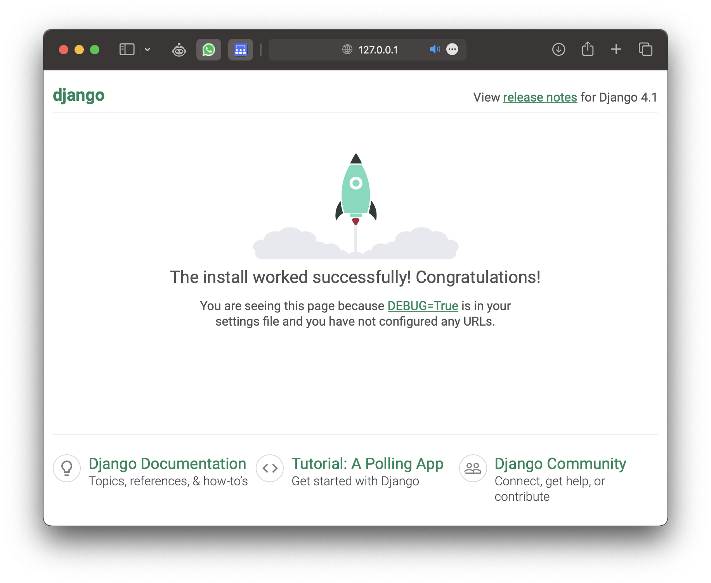

- [Django](#django)
- [1 Setup](#setup)
  - [1.1 Creating a project](#creating-a-project)
  - [1.2 Structure](#structure)
- [2 Applications](#applications)
- [3 Routes](#routes)
  - [3.1 Routing to your app](#routing-to-your-app)
  - [3.2 Parameterized routes](#parameterized-routes)

# Django

In the first lecture, we have discussed from a high-level how the web
works. To recapitulate, once a URL is entered into the browser, the
browser looks for the corresponding IP address via DNS lookup, connects
to a server, sends the user’s **request** using HTTP (hyper-text
transfer protocol) and in turn waits for the server to process and
**respond** to that request.

So far, we have looked at the basic building blocks that the browser
understands, namely HTML, CSS, and JavaScript. These are considered
**frond-end** technologies, stuff that is directly visible to the user.

Now, we will take a look at [Django](https://www.djangoproject.com), a
Python web framework that lets us build a **back-end** server. Django
allows us to receive HTTP requests and respond with anything we wish, be
it static files (html, css, images, etc.), dynamically generated HTML
files, or JSON objects, to name a few.

# 1 Setup

## 1.1 Creating a project

Make sure [Python 3](https://www.python.org/downloads/) and
[pip3](https://pypi.org/project/pip/) are installed. Then, in the
command line (i.e., Terminal), run `pip3 install Django` to install
Django.

To create a project, run the following commands (alternatively you can
take a look at
[PyCharm](https://www.jetbrains.com/help/pycharm/creating-and-running-your-first-django-project.html)):

1.  `django-admin startproject PROJECT_NAME`: create the basic structure
    of the project.
2.  `cd PROJECT_NAME`: navigate into the project folder.
3.  `python manage.py runserver`: Start the server. (you may need to
    specify `python3 manage.py runserver` depending on how Python is
    installed on your machine)

You should see something like this:

    $ python3 manage.py runserver
    Watching for file changes with StatReloader
    Performing system checks...

    System check identified no issues (0 silenced).

    You have 18 unapplied migration(s). Your project may not work properly until you apply the migrations for app(s): admin, auth, contenttypes, sessions.
    Run 'python manage.py migrate' to apply them.
    March 08, 2023 - 20:01:00
    Django version 4.1.7, using settings 'PROJECT_NAME.settings'
    Starting development server at http://127.0.0.1:8000/
    Quit the server with CONTROL-C.

We can savely ignore most debug messages and focus on the second-last
row. It says that the server can be reached via
`http://127.0.0.1:8000/`. Recall that `http` stands for the protocol,
`127.0.0.1` the IP address (which here is a special address only
accessible from our own device, also known as `localhost`) and `:8000`
the port the server listens to.

Opening the URL should show you a default page Django has prepared.

<figure>

<figcaption aria-hidden="true">Django homepage</figcaption>
</figure>

## 1.2 Structure

Open the project in your editor of choice. It should contain the
following files and folders.

    .
    ├── db.sqlite3
    ├── manage.py
    └── PROJECT_NAME/
        ├── __init__.py
        ├── __pycache__/
        │   ├── ...
        ├── asgi.py
        ├── settings.py
        ├── urls.py
        └── wsgi.py

The important files to take note of are:

- `manage.py`: We won’t edit that file, but use it to run a bunch of
  commands. Simply running `python manage.py` gives you a bunch of
  available subcommands.
- `settings.py`: Settings for the project, such as installed apps,
  middleware, directories for static files, etc.
- `urls.py`: routing information, which app handles what subroutes.

# 2 Applications

A Django project is split into several **applications**. This helps us
split a big project into smaller chunks, each with its own distinct
purpose.

Within your project, create a new app by

1.  running `python manage.py startapp APP_NAME`, and
2.  adding `APP_NAME` to the list `INSTALLED_APPS` inside `settings.py`.
3.  Add the specific route to your app in `PROJECT_NAME/urls.py`.

<details>
<summary>
(the third step will be delved into in the next section, but you can
view the code here)
</summary>

``` python
from django.contrib import admin
from django.urls import path, include # don't forget to import include

urlpatterns = [
  path('myapp/', include('APP_NAME.urls')),
  path('admin/', admin.site.urls),
]
```

</details>

Running the `startapp` subcommand creates a new directory.

    ├── MY_APP/
    │   ├── __init__.py
    │   ├── __pycache__/
    │   │   ├── ...
    │   ├── admin.py
    │   ├── apps.py
    │   ├── migrations/
    │   │   ├── ...
    │   ├── models.py
    │   ├── tests.py
    │   └── views.py

# 3 Routes

## 3.1 Routing to your app

In order to tell Django, what the user should get depending on the URL
they have typed in, we need to create functions in Python that take in a
**request** object as a parameter and return some type of **response**
object for Django to send back to the user.

1.  Open `MY_APP/views.py`.
2.  Add a function creating a response.

<details>
<summary>
Code
</summary>

``` python
from django.http import HttpResponse

def index(request):
  return HttpResponse('Hello, World')
  
def greet_brian(request):
  return HttpResponse('Hello, Brian')
```

</details>

3.  Create a file `MY_APP/urls.py`. This lets us **route** URLs to the
    corresponding functions in Python that we have created.
4.  Add the following to the newly created `MY_APP/urls.py` file.

<details>
<summary>
Code
</summary>

``` python
from django.urls import path
from . import views

app_name = 'MY_APP'
urlpatterns = [
  path('', views.index, name='index'),
  path('brian/', views.index, name='brian')
]
```

<details>
<summary>
Description
</summary>

The `path` function lets us tell Django, which URL paths are linked to
which Python functions. Upon calling the function, we pass in three
parameters:

1.  the first parameter is the route, or the specific URL, that we want
    to catch,
2.  the second parameter points to the function Django should call once
    the user types in the specific URL,
3.  finally, the third parameter specifies a name that can be accessed
    in templates to link between pages.

Notice that `app_name` is also specified
</details>
</details>

5.  Don’t forget to add the route to that app to your project. Inside
    `PROJECT_NAME/urls.py`, add the following:

``` python
from django.contrib import admin
from django.urls import path, include # don't forget to import include

urlpatterns = [
  path('myapp/', include('APP_NAME.urls')),
  path('admin/', admin.site.urls)
]
```

If we now start the server using `python manage.py runserver`, opening
up `127.0.0.1:8000/myapp` returns the `HttpResponse` from step 2.

## 3.2 Parameterized routes
