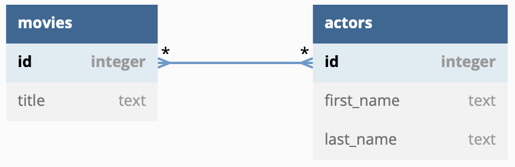
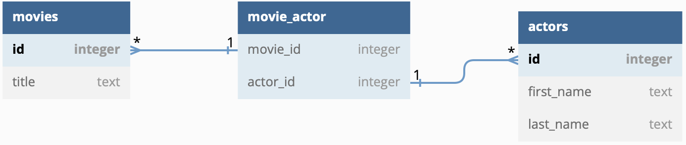
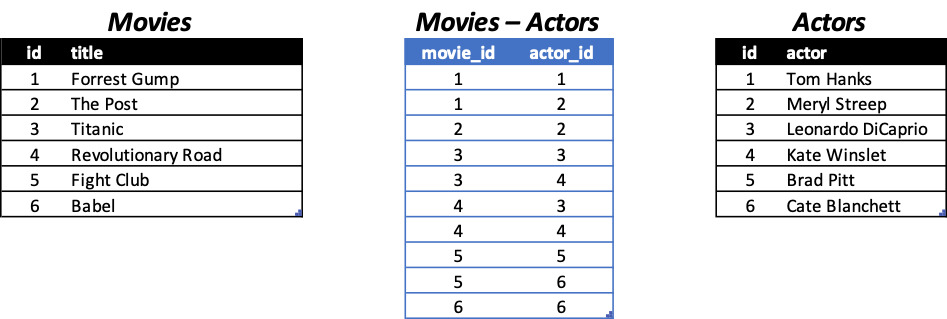

- [More SQL and React](#more-sql-and-react)
- [1 SQL and Many-to-Many
  relationships](#1-sql-and-many-to-many-relationships)
  - [1.1 SQLite](#11-sqlite)
  - [1.2 Modeling](#12-modeling)

# More SQL and React

To finish the SQL section, we look at how to model many-to-many
relationships. After that, JavaScript is re-introduced as a means to
enhance the user experience when navigating our site, i.e., by using
animation, dynamically loading data, and creating a so-called
[singe-page
application](https://en.wikipedia.org/wiki/Single-page_application). We
conclude with React, a JavaScript front-end framework that helps us
better structure our front-end.

# 1 SQL and Many-to-Many relationships

Recall from the previous lecture that we used a foreign key to represent
one-to-many relationships.
[Here](https://github.com/DauphineWeb/ProgrammationWeb2023/tree/main/03-23%20SQL#16-foreign-keys)
we’ve modeled that one author can have many books, and
[here](https://github.com/DauphineWeb/ProgrammationWeb2023/tree/main/03-23%20SQL#21-models)
we’ve modeled that a problem set can contain many questions.

We could have also modeled these as *many-to-many* relationships. Just
as an author can have written many books, a book could have been written
by many authors. Just as a problem set contains many question, a
professor may want to re-use a question in multiple problem sets.

Other examples may include:

- a student visiting a course in university, and the course being
  attended by many students,
- a movie starring multiple actors, and an actor starring in multiple
  movies,
- an order of multiple products, and a product being part of multiple
  orders.

In a relational database graph, this relation is often shown with a line
and stars (`*`) on either side, symbolizing the “any”-amount. (courtesy
of [https://dbdiagram.io/](https://dbdiagram.io/d))



It’s not possible to represent this many-to-many relationship in SQLite
with just two tables. Instead, we need a third table joining the tables
together.



Notice the one-to-many relationships here. Each row (or record) inside
`movie_actor` is a unique pair of a movie and a actor.



## 1.1 SQLite

Similar to how we have created a one-to-many relationship in the [last
lecture](https://github.com/DauphineWeb/ProgrammationWeb2023/tree/main/03-23%20SQL#16-foreign-keys)
using foreign keys, the intermediary table simply contains two foreign
keys pointing to either table.

``` sql
CREATE TABLE actor (
    id INTEGER PRIMARY KEY AUTOINCREMENT,
    name TEXT NOT NULL
);

CREATE TABLE movie (
    id INTEGER PRIMARY KEY AUTOINCREMENT,
    title TEXT NOT NULL
);

CREATE TABLE actor_movie (
    actor_id INTEGER NOT NULL,
    movie_id INTEGER NOT NULL,
    FOREIGN KEY (actor_id) REFERENCES actor (id),
    FOREIGN KEY (movie_id) REFERENCES movie (id)
);
```

Inserting values does not involve any more magic than before.

``` sql
-- Insert actors
INSERT INTO actor (name) VALUES ('Tom Hanks');
INSERT INTO actor (name) VALUES ('Meryl Streep');
INSERT INTO actor (name) VALUES ('Leonardo DiCaprio');
INSERT INTO actor (name) VALUES ('Kate Winslet');
INSERT INTO actor (name) VALUES ('Brad Pitt');
INSERT INTO actor (name) VALUES ('Cate Blanchett');

-- Insert movies
INSERT INTO movie (title) VALUES ('Forrest Gump');
INSERT INTO movie (title) VALUES ('The Post');
INSERT INTO movie (title) VALUES ('Titanic');
INSERT INTO movie (title) VALUES ('Revolutionary Road');
INSERT INTO movie (title) VALUES ('Fight Club');
INSERT INTO movie (title) VALUES ('Babel');

-- Insert actor-movie relationships
INSERT INTO actor_movie (actor_id, movie_id) VALUES (1, 1); -- Tom Hanks - Forrest Gump
INSERT INTO actor_movie (actor_id, movie_id) VALUES (1, 2); -- Tom Hanks - The Post
INSERT INTO actor_movie (actor_id, movie_id) VALUES (2, 2); -- Meryl Streep - The Post
INSERT INTO actor_movie (actor_id, movie_id) VALUES (3, 3); -- Leonardo DiCaprio - Titanic
INSERT INTO actor_movie (actor_id, movie_id) VALUES (3, 4); -- Leonardo DiCaprio - Revolutionary Road
INSERT INTO actor_movie (actor_id, movie_id) VALUES (4, 3); -- Kate Winslet - Titanic
INSERT INTO actor_movie (actor_id, movie_id) VALUES (4, 4); -- Kate Winslet - Revolutionary Road
INSERT INTO actor_movie (actor_id, movie_id) VALUES (5, 5); -- Brad Pitt - Fight Club
INSERT INTO actor_movie (actor_id, movie_id) VALUES (5, 6); -- Brad Pitt - Babel
INSERT INTO actor_movie (actor_id, movie_id) VALUES (6, 6); -- Cate Blanchett - Babel
```

Using the intermediary table we can make queries on both tables using
their ids.

``` sql
-- Find out what id 'Titanic' has
SELECT id FROM movie WHERE title = 'Titanic'; -- 3

-- Find out in the intermediary table which actors played in 'Titanic'
SELECT actor_id FROM actor_movie WHERE movie_id = 3; -- 3, 4

-- Find out the names of these actors
SELECT name FROM actor WHERE id IN (3, 4); -- Leonardo DiCaprio, Kate Winslet
```

We can skip the first two steps by simply [joining the
tables](https://github.com/DauphineWeb/ProgrammationWeb2023/tree/main/03-23%20SQL#17-joining-tables)
together. With all the columns present, there is no need then to
remember the ids that we are looking for.

``` sql
-- List actors who played in 'Titanic'
SELECT actor.name FROM actor
  JOIN actor_movie ON actor.id = actor_movie.actor_id
  JOIN movie ON movie.id = actor_movie.movie_id
  WHERE movie.title = 'Titanic';

-- Alternatively (could use ON or WHERE interchangeably)
SELECT actor.name FROM actor,actor_movie,movie
  WHERE actor.id = actor_movie.actor_id
  AND movie.id = actor_movie.movie_id
  AND movie.title = 'Titanic';

-- Other examples
-- 
-- List movies that Tom Hanks starred in
SELECT movie.title FROM movie
  JOIN actor_movie ON movie.id = actor_movie.movie_id
  JOIN actor ON actor.id = actor_movie.actor_id
  WHERE actor.name = 'Tom Hanks'; -- Forrest Gump, The Post

-- Show all movies with all their actors
-- (basically the entire actor_movie table with the numbers replaced by their names)
SELECT actor.name, movie.title FROM actor
  JOIN actor_movie ON actor.id = actor_movie.actor_id
  JOIN movie ON movie.id = actor_movie.movie_id
  ORDER BY actor.name, movie.title;

-- List actors and count the number of movies they've been in
-- simply count by grouping the actor ids: SELECT actor_id, COUNT(movie_id) FROM actor_movie GROUP BY actor_id;
SELECT actor.name, COUNT(DISTINCT am.movie_id) AS num_movies FROM actor
  JOIN actor_movie am ON actor.id = am.actor_id
  GROUP BY actor.id, actor.name
  ORDER BY num_movies DESC, actor.name;
```

## 1.2 Modeling

In Django, we can use a
[`ManyToManyField`](https://docs.djangoproject.com/en/4.2/topics/db/examples/many_to_many/)
to model the relationship between movies and actors.

``` python
# app/models.py
from django.db import models

class Actor(models.Model):
    name = models.CharField(max_length=100)
    def __str__(self):
        return self.name

class Movie(models.Model):
    title = models.CharField(max_length=100)
    actors = models.ManyToManyField(Actor, related_name='movies')
    def __str__(self):
        return self.title
```

Notice that we were not required to add an intermediary table. Django
will do it for us. Once we migrate the changes…

``` sh
$ python3 manage.py makemigrations
$ python3 manage.py migrate
```

… we can view the new tables in SQLite.

``` sh
$ sqlite3 db.sqlite3
sqlite> .tables
# ...
movies_actor
movies_movie
movies_movie_actors
# ...
```

Here, our app is called `movies`. Hence, every table created from our
models within that app starts with the `movies_` prefix.

In the SQLite shell, we can again add our example values from before.

``` sql
INSERT INTO movies_actor (name) VALUES ('Tom Hanks'), ('Meryl Streep'), ('Leonardo DiCaprio'), ('Kate Winslet'), ('Brad Pitt'), ('Cate Blanchett');
INSERT INTO movies_movie (title) VALUES ('Forrest Gump'), ('The Post'), ('Titanic'), ('Revolutionary Road'), ('Fight Club'), ('Babel');
INSERT INTO movies_movie_actor (actor_id, movie_id) VALUES (1, 1), (1, 2), (2, 2), (3, 3), (3, 4), (4, 3), (4, 4), (5, 5), (5, 6), (6, 6);
```

We then can start querying for the same records that we did before. Take
note again that the `Movie` model has a field called `actors` on which
we can perform further queries on. Furthermore, because we have
specified `related_name='movies'` in the `actors` field, we are able to
perform queries on the `Actor` model looking for related data in the
`Movie` tabl

``` python
$ python3 manage.py shell
# ... starting interactive shell ... #

from movies.models import *

# get all actors from 'The Post'
movie = Movie.objects.get(title='The Post')
movie.actors.all() # <QuerySet [<Actor: Tom Hanks>, <Actor: Meryl Streep>]>

# get all movies played by Tom Hanks
actor = Actor.objects.get(name='Tom Hanks')
actor.movies.all() # <QuerySet [<Movie: Forrest Gump>, <Movie: The Post>]>

# list all movies with all actors
actors = Actor.objects.all()
for actor in actors:
    print(f'{actor.name} played in {", ".join([movie.title for movie in actor.movies.all()])}')

# alternatively use prefetch_related, which automatically combines the Movie and Actor tables in a single query making it much more efficient
# https://docs.djangoproject.com/en/4.2/ref/models/querysets/#prefetch-related
from django.db.models import Prefetch
actors = Actor.objects.prefetch_related(Prefetch('movies', queryset=Movie.objects.all())).all()
for actor in actors:
    print(f'{actor.name} played in {", ".join([movie.title for movie in actor.movies.all()])}')

# count number of movies an actor starred in
from django.db.models import Count

# we can use aggregate() to count all movies (or filtered ones)
Actor.objects.aggregate(Count('movies')) # {'movies__count': 10}
Actor.objects.filter(name='Tom Hanks').aggregate(Count('movies')) # {'movies__count': 2}

# we can use annotate() to group the results by each actor
actors = Actor.objects.annotate(num_movies=Count('movies')).order_by('-num_movies', 'name')
for actor in actors:
    print(f'{actor.name} - {actor.num_movies} movie(s)')
```

As always, it is well worth the time to have a look at Django's documentation, containing many helpful examples and references on how to use:

- [`aggregate(), annotate()`](https://docs.djangoproject.com/en/4.2/topics/db/aggregation/)
- [`Prefetch()`](https://docs.djangoproject.com/en/4.2/ref/models/querysets/#prefetch-objects)
  and
  [`prefetch_related()`](https://docs.djangoproject.com/en/4.2/ref/models/querysets/#prefetch-related)
- [`many-to-many Relationships`](https://docs.djangoproject.com/en/4.2/topics/db/examples/many_to_many/)
