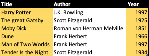

- [SQL](#sql)
- [1 Databases](#1-databases)
  - [1.1 SQLite](#11-sqlite)
  - [1.2 Performing SQL statements](#12-performing-sql-statements)
  - [1.3 Queries](#13-queries)
  - [1.4 Updates](#14-updates)
  - [1.5 Delete](#15-delete)
  - [1.6 Foreign Keys](#16-foreign-keys)
  - [1.7 Joining tables](#17-joining-tables)
  - [1.8 Vulnerabilities](#18-vulnerabilities)
- [2 Creating a Django project](#2-creating-a-django-project)
  - [2.1 Models](#21-models)
  - [2.2 Working with the db](#22-working-with-the-db)
  - [2.3 Admin](#23-admin)
  - [2.4 Creating the templates](#24-creating-the-templates)
- [3 User authentication](#3-user-authentication)
  - [3.1 Is user logged in](#31-is-user-logged-in)
  - [3.2 Log a user in](#32-log-in-a-user)
  - [3.3 Log a user out](#33-log-out-a-user)

# SQL

In the previous section, we have only saved data in lists and
dictionaries during runtime. This caused us to lose all the data every
time the server restarted.

To *persistently* save data, we will take a look at how to work with
relational databases and use SQL to efficiently save and retrieve this
information.

# 1 Databases

Relational databases allow us to store our data in the form of tables.
Every table has a fixed number of *columns* and a variable number of
*rows*.

Examples of relational databases include
[MySQL](https://www.mysql.com/de/),
[PostgreSQL](https://www.postgresql.org),
[SQLite](https://www.sqlite.org/index.html) and
[Oracle](https://www.oracle.com/database/). Next to relational databases
there exist [other
databases](https://www.enterpriseappstoday.com/business-intelligence/5-alternatives-to-the-traditional-relational-database.html)
to . Depending on the different of an application, different types of
databases might be more suitable than others. Since Django has SQLite
built-in however, we will be focusing on that.

## 1.1 SQLite

Databases in SQLite are saved in files. Within such a file we can create
multiple tables and perform queries on them.

The columns of a table may be expected to only contain values of a
certain type, sometimes also referred to as [type
affinity](https://www.sqlite.org/datatype3.html#type_affinity). Compared
to other relational databases, SQLite offers only a small number of
different types for columns:

- `TEXT`: a string
- `NUMERIC`: generic number representation, i.e., for dates or boolean
  values
- `INTEGER`: whole numbers (-2, -1, 0, 1, 2, …)
- `REAL`: real numbers (0.25, 9e10, 1, 3.141, …)
- `BLOB`: "Binary Large Object", binary data (i.e., for images, pdfs,
  encrypted messages, …)

## 1.2 Performing SQL statements

We can use the Terminal or any external UI-tool such as
[SQLiteBrowser](https://sqlitebrowser.org/dl/) to work on a SQLite
database file. In the Terminal, we may do the following (note that in
SQL, `"--"` symbolizes a comment).

``` sql
-- create relational database file
$ touch courses.sqlite3

-- enter SQLite prompt
$ sqlite3 courses.sqlite3
SQLite version 3.39.5 2022-10-13 14:58:05
Enter ".help" for usage hints.

-- Create a new table
CREATE TABLE books(
    id INTEGER PRIMARY KEY AUTOINCREMENT,
    title TEXT NOT NULL,
    author TEXT NOT NULL,
    year INTEGER NOT NULL
);

-- List all tables
.tables

-- insert values
INSERT INTO books (title, author, year) VALUES ("Harry Potter", "J.K. Rowling", 1997);
INSERT INTO books (title, author, year) VALUES ("The great Gatsby", "Scott Fitzgerald", 1925);
INSERT INTO books (title, author, year) VALUES ("Moby Dick", "Roman von Herman Melville", 1851);
INSERT INTO books (title, author, year) VALUES ("Dune", "Frank Herbert", 1966);
INSERT INTO books (title, author, year) VALUES ("Man of Two Worlds", "Frank Herbert", 1997);
INSERT INTO books (title, author, year) VALUES ("Tender Is the Night", "Scott Fitzgerald", 1934);

-- list all entries
SELECT * FROM books;

-- make output more pretty
.mode columns
.headers yes

SELECT * FROM books;
-- id  title                author                     year
-- --  -------------------  -------------------------  ----
-- 1   Harry Potter         J.K. Rowling               1997
-- 2   The great Gatsby     Scott Fitzgerald           1925
-- 3   Moby Dick            Roman von Herman Melville  1851
-- 4   Dune                 Frank Herbert              1966
-- 5   Man of Two Worlds    Frank Herbert              1997
-- 6   Tender Is the Night  Scott Fitzgerald           1934
```

## 1.3 Queries

The `WHERE` clause is used to filter the rows of a table. Consider the
table from before, which looks something like this (note, the id is left
out).


We may filter the rows as follows.

<details>
<summary>
SELECT \* FROM books WHERE author = "Scott Fitzgerald";
</summary>


</details>
<details>
<summary>
SELECT \* FROM books WHERE year \< 1950;
</summary>


</details>
<details>
<summary>
SELECT \* FROM books WHERE year \> 1970 AND author = "Scott Fitzgerald";
</summary>


</details>
<details>
<summary>
SELECT \* FROM books WHERE year \> 1970 OR author = "Scott Fitzgerald";
</summary>


</details>

We can also seep out individual columns.

<details>
<summary>
SELECT title, year FROM books;
</summary>



</details>

Some other clauses include

``` sql
-- Similar to python's IN expression
SELECT * FROM books WHERE author IN ("Scott Fitzgerald", "J.K. Rowling");

-- Wild-card, find books that start with a T, followed by anything
SELECT * FROM books WHERE title LIKE "T%";

-- Get the average of all the numbers in the year column
SELECT AVG(year) FROM books;

-- Find latest book publication from each author
SELECT author, MAX(year) FROM books GROUP BY author;

-- Order them by their title and give us the first three results
-- (here it returns the books Dune, Harry Potter and Man of Two Worlds)
SELECT * FROM books ORDER BY title LIMIT 3;
```

## 1.4 Updates

An example of using `UPDATE` to change the value of a cell. Note that if
the `WHERE` clause returns more than one row, it will change the value
for each filtered row.

``` sql
UPDATE books
  SET title = "Harry Potter and the scorcerer's stone"
  WHERE id = 1;
```

## 1.5 Delete

An example of using `DELETE` to delete one or more rows of data in our
table.

``` sql
DELETE FROM books WHERE year < 1950;
```

## 1.6 Foreign Keys

When adding more and more books, the same author may appear multiple
times.

``` python
INSERT INTO books (author, year, title) VALUES
  ("J.K. Rowling", 1998, "Harry Potter and the Chamber of Secrets"),
  ("J.K. Rowling", 1999, "Harry Potter and the Prisoner of Azkaban"),
  ("J.K. Rowling", 2000, "Harry Potter and the Goblet of Fire"),
  ("J.K. Rowling", 2003, "Harry Potter and the Order of the Phoenix"),
  ("J.K. Rowling", 2005, "Harry Potter and the Half-Blood Prince"),
  ("J.K. Rowling", 2007, "Harry Potter and the Deathly Hallows")
;
```

This form of redundancy could cause issues. For one, we're just wasting
space. Secondly, we have to be very sure that there's no typo when
entering the author's name. Lastly, if we want to update the name of an
author, we need to be sure to update *all* rows containing that author's
name.

What we want to apply when structuring databases is the concept of
[Single Source of
Truth](https://en.wikipedia.org/wiki/Single_source_of_truth).

Here, it makes sense to introduce a table `authors`. Then, in our
`books` table, for any book we want the `author` cell to point to the
corresponding id of the author in the `authors` table.


Here, the Author column contains so-called *foreign keys*. It is a
constraint that specifies that any value in that column must be linked
to the Ids of the Authors table.

In [SQLite](https://www.sqlite.org/foreignkeys.html), we can add the
constraint like this.

``` sql
CREATE TABLE authors(
    id INTEGER PRIMARY KEY AUTOINCREMENT,
    first_name TEXT NOT NULL,
    last_name TEXT NOT NULL
);

-- note that the books column doesn't "exist" in this context
CREATE TABLE books(
    id INTEGER PRIMARY KEY AUTOINCREMENT,
    title TEXT NOT NULL,
    author_id TEXT NOT NULL,
    year INTEGER NOT NULL,
    FOREIGN KEY(author) REFERENCES authors(id)
);
```

Now, any time we add a book, giving it an `author_id` that does not
exist in the `authors` table will throw an error.

It is also sensible to add a `CASCADE` action to our books table.

``` sql
CREATE TABLE books(
    -- ...
    FOREIGN KEY(author) REFERENCES authors(id) ON DELETE CASCADE
)
```

This implies that, if an author in the `authors` table is deleted, it
should automatically delete all books from that author as well.

### 1.6.1 Applying the changes to our `books` table

Unfortunately, we have already created a `book` table, and altering it
in SQLite the way we want to isn't quite as straight-forward as one
would assume. If you feel motivated to do it in SQL anyways, you can
follow the instructions below.

<details>
<summary>
Instructions
</summary>

``` sql
-- Add authors to the list of authors
-- (first_name will contain entire name, last_name an empty string for simplicity's sake)
INSERT INTO authors(first_name, last_name) SELECT DISTINCT author,'' FROM books;

-- In SQLite, foreign key constraints cannot be added after the table has been created (https://stackoverflow.com/q/1884818).
-- Therefore, we'll need to create a new table
ALTER TABLE books RENAME TO books_old;
CREATE TABLE books(
    id INTEGER PRIMARY KEY AUTOINCREMENT,
    title TEXT NOT NULL,
    author_id TEXT NOT NULL,
    year INTEGER NOT NULL,
    FOREIGN KEY(author_id) REFERENCES authors(id)
);

-- transfer rows from books_old to books, replace author with corresponding author_id
INSERT INTO books (id, title, year, author_id)
  SELECT id, title, year, (SELECT authors.id FROM authors WHERE authors.first_name = books_old.author)
  FROM books_old;

-- delete old table
DROP TABLE books_old;
```

</details>

## 1.7 Joining tables

Our `books` table now contains a reference to the `authors` table. To
present users with the author name for each book, we can join them
together.

``` sql
SELECT * FROM books JOIN authors ON books.author_id = authors.id;
```

<details>
<summary>
Output
</summary>

    id  title                                      author_id  year  id  first_name  last_name          
    --  -----------------------------------------  ---------  ----  --  ----------  -------------------
    1   Harry Potter and the scorcere's stone      1          1997  1   J.K.        Rowling            
    2   The great Gatsby                           2          1925  2   Scott       Fitzgerald         
    3   Moby Dick                                  3          1851  3   Roman       von Herman Melville
    4   Dune                                       4          1966  4   Frank       Herbert            
    5   Man of Two Worlds                          4          1997  4   Frank       Herbert            
    6   Tender Is the Night                        2          1934  2   Scott       Fitzgerald         
    7   Harry Potter and the Chamber of Secrets    1          1998  1   J.K.        Rowling            
    8   Harry Potter and the Prisoner of Azkaban   1          1999  1   J.K.        Rowling            
    9   Harry Potter and the Goblet of Fire        1          2000  1   J.K.        Rowling            
    10  Harry Potter and the Order of the Phoenix  1          2003  1   J.K.        Rowling            
    11  Harry Potter and the Half-Blood Prince     1          2005  1   J.K.        Rowling            
    12  Harry Potter and the Deathly Hallows       1          2007  1   J.K.        Rowling

</details>

Some columns now become redundant. In place of `*`, we can specify which
columns from `books` and `authors` we want to keep.

``` sql
SELECT books.title, authors.first_name, authors.last_name, books.year FROM books JOIN authors ON books.author_id = authors.id;
```

<details>
<summary>
Output
</summary>

    title                                      first_name  last_name            year
    -----------------------------------------  ----------  -------------------  ----
    Harry Potter and the scorcere's stone      J.K.        Rowling              1997
    The great Gatsby                           Scott       Fitzgerald           1925
    Moby Dick                                  Roman       von Herman Melville  1851
    Dune                                       Frank       Herbert              1966
    Man of Two Worlds                          Frank       Herbert              1997
    Tender Is the Night                        Scott       Fitzgerald           1934
    Harry Potter and the Chamber of Secrets    J.K.        Rowling              1998
    Harry Potter and the Prisoner of Azkaban   J.K.        Rowling              1999
    Harry Potter and the Goblet of Fire        J.K.        Rowling              2000
    Harry Potter and the Order of the Phoenix  J.K.        Rowling              2003
    Harry Potter and the Half-Blood Prince     J.K.        Rowling              2005
    Harry Potter and the Deathly Hallows       J.K.        Rowling              2007

</details>

## 1.8 Vulnerabilities

SQL injection is one of the most predominant sources of vulnerabilities
on servers. If some SQL query is dependent on user input, upmost caution
must be held to sanitize their input.

Suppose we have a login form. One (bad) way to check if the username and
password is correct is as follows.

``` python
def can_login(username, password):
    sql_statement = f'SELECT * FROM users WHERE username="{username}" AND password="{password}"'
    user = execute_sql_statement(sql_statement)
    return len(user) > 0
```

Now, as user may enter the following string into the username box…

    Henry"; --

… resulting in the following sql statement.

``` sql
SELECT * FROM users WHERE username="Henry"; --" AND password="{password}"
```

Hence, the user can now login as `Henry` without knowing their password.

In modern system, one should always rely on libraries that saves us from
having to handle sql statements directly.

# 2 Creating a Django project

For our project, we want to create a database of problem sets, each of
which contains zero or more questions.

``` bash
# create project
django-admin startproject project
cd project

# create application
python3 manage.py startapp psets
```

After adding `'psets'` to the list of applications in
`project/settings.py`, we redirect any the base urls to the `psets`
application.

``` python
from django.contrib import admin
from django.urls import path, include

urlpatterns = [
    path('', include('psets.urls')),
    path('admin/', admin.site.urls),
]
```

In `psets/urls.py`, we add the following paths:

- `''`: index path, list all problem sets,
- `pset/add`: add new problem set,
- `pset/<id>`: list questions in problem set.

You may notice that we are not able to add a question to a problem set.
This may be introduced in later iterations, but for now we are only
concerned with problem sets from the front end.

As such, we will add the following routes to `psets/urls.py`.

``` python
from django.urls import path
from . import views

urlpatterns = [
    path('', views.index, name='index'),
    path('pset/add', views.add_pset, name='add'),
    path('pset/<int:pset_id>', views.view_pset, name='pset'), # maybe
]
```

In `psets/views.py`, we create some temporary functions for now.

``` python
from django.shortcuts import render

def index(request):
    pass

def add_pset(request):
    pass

def view_pset(request, pset_id):
    pass
```

## 2.1 Models

Technically, we could go into the SQL shell and add the necessary
tables.

``` sql
CREATE TABLE psets(
  id INTEGER PRIMARY KEY AUTOINCREMENT,
  title TEXT NOT NULL,
  due_date NUMBER
);

CREATE TABLE questions(
  id INTEGER PRIMARY KEY AUTOINCREMENT,
  title TEXT NOT NULL,
  description TEXT,
  score INTEGER NOT NULL,
  pset_id INTEGER NOT NULL,
  FOREIGN KEY(pset_id) REFERENCES psets(id)
);
```

Instead, we want to use Django to create these tables for us. To do
that, we introduce ourselves to Django's
[models](https://docs.djangoproject.com/en/4.1/topics/db/models/).

A model is represented as a simple class in python, inheriting form the
`Model` class in Django. In `psets/models.py`, we write the following.

``` python
from django.db import models

class ProblemSet(models.Model):
    title = models.CharField(max_length=100)
    due = models.DateField()
    
    def __str__(self):
        return f'{self.title}, due {self.due}'


class Question(models.Model):
    title = models.CharField(max_length=100)
    description = models.TextField()
    score = models.IntegerField()
    problem_set = models.ForeignKey(ProblemSet, on_delete=models.CASCADE, related_name='questions')
    
    def __str__(self):
        return f'{self.title}, {self.score} points'
```

Here, we use the following
[fields](https://docs.djangoproject.com/en/4.1/ref/models/fields/):

- [`CharField`](https://docs.djangoproject.com/en/4.1/ref/models/fields/#charfield):
  strings with a maximum number of characters. `max_length` must be set
  in `CharField`.
- [`TextField`](https://docs.djangoproject.com/en/4.1/ref/models/fields/#textfield):
  for larger texts, i.e., from textarea input fields.
- [`IntegerField`](https://docs.djangoproject.com/en/4.1/ref/models/fields/#integerfield):
  whole values, negative and positive.
- [`DateField`](https://docs.djangoproject.com/en/4.1/ref/models/fields/#datefield):
  a date representation, i.e., `'2023-02-27'`.
- [`ForeignKey`](https://docs.djangoproject.com/en/4.1/ref/models/fields/#module-django.db.models.fields.related):
  a many-to-one relationship. Here, we signify that `ProblemSet` can
  contain many `Question` objects. We also specify:
  - [`on_delete=models.CASCADE`](https://docs.djangoproject.com/en/4.1/ref/models/fields/#django.db.models.ForeignKey.on_delete):
    if a `ProblemSet` object is deleted, so too are the `Question`
    objects it contains. Other options are, among others, `PROTECT`,
    which disallows the deletion of `ProblemSet` objects if it contains
    questions, as well as `SET_NULL` and `SET_DEFAULT`.
  - [`related_name='questions'`](https://docs.djangoproject.com/en/4.1/ref/models/fields/#django.db.models.ForeignKey.related_name):
    make it easy to create a backwards relation from a `ProblemSet`
    object to its `Question` objects.

Notice that we did not need to explicitly define a field `id`, Django
will implicitly do it for us.

Making changes to a database model always involves a two-step process.

First we have to call `makemigrations` for Django to create a migrations
file in `psets/migrations`. Then we call `migrate` to actually execute
these changes within our database.

``` sh
python3 manage.py makemigrations
# Migrations for 'psets':
#   psets/migrations/0001_initial.py
#     - Create model ProblemSet
#     - Create model Question

python3 manage.py migrate
# Operations to perform:
#   Apply all migrations: admin, auth, contenttypes, psets, sessions
# Running migrations:
#   Applying psets.0001_initial... OK
```

<!--
```python
from django.db import models
from django.forms import ModelForm
from django.core.exceptions import ValidationError
&#10;class ProblemSet(models.Model):
    name = models.CharField(max_length=100)
    due = models.DateField()
&#10;    def __str__(self):
        return self.name
&#10;class Question(models.Model):
    description = models.TextField()
    score = models.IntegerField()
    problem_set = models.ForeignKey(ProblemSet, on_delete=models.CASCADE, related_name='questions')
&#10;    def __str__(self):
        return self.description
&#10;class QuestionForm(ModelForm):
    class Meta:
        model = Question
        fields = [ 'description', 'score', 'problem_set' ]
&#10;class Student(models.Model):
    name = models.CharField(max_length=100)
    problem_sets = models.ManyToManyField(ProblemSet, related_name='students')
&#10;    def __str__(self):
        return self.name
```
-->

## 2.2 Working with the db

Within our project, we can start a shell to execute database queries
using python commands. To enter the shell, execute

    python3 manage.py shell

From here, we can import our models and start creating and quering for
objects.

``` python
from psets.models import *

# add a new problem set to the database
pset1 = ProblemSet(title='Problem set 5', due='2023-04-02')
pset1.save()

# add two new questions to the problem set
q1 = Question(title='Poly', description='Describe polyphornism', score=4, problem_set=pset1)
q1.save()
q2 = Question(title='SQLs', description='What is the difference between SQL and NoSQL?', score=3, problem_set=pset1)
q2.save()

# retrieve all problem sets
ProblemSet.objects.all()
# <QuerySet [<ProblemSet: Problem set 5, due 2023-04-02>]>

# retrieve first result
pset = ProblemSet.objects.first()
pset.title
# 'Problem set 5'
pset.due
# datetime.date(2023, 4, 2)

# get questions from problem set
# note that the "related_name" field from our Question model comes to play here!
pset.questions.all()
# <QuerySet [<Question: Poly, 4 points>, <Question: SQLs, 3 points>]>

# filter questions that give a score of 3 or 2.
pset.questions.filter(score=3)
# <QuerySet [<Question: SQLs, 3 points>]>
pset.questions.filter(score=2)
# <QuerySet []>

# get single question by id using its primary key.
# Note that in contrast to filter(), get() throws an error if it didn't find a unique object.
Question.objects.get(pk=2)
# <Question: SQLs, 3 points>
```

## 2.3 Admin

Instead of using the shell to make changes to our database, Django
provides a web [admin
interface](https://docs.djangoproject.com/en/4.1/ref/contrib/admin/) to
make matters simple.

First, make sure that the admin site is reachable. In `project/urls.py`,
the following url must be registered.

``` python
from django.contrib import admin
# ...

urlpatterns = [
    path('admin/', admin.site.urls),
    # ...
]
```

Then, we will create a super user.

    $ python3 manage.py createsuperuser
    Username (leave blank to use 'felix'): 
    Email address: felix.fritz@dauphine.psl.eu
    Password: <not visible>
    Password (again): <still not visible>
    Superuser created successfully.

After starting our server with `python3 manage.py runserver`, we can
access and log into the admin dashboard in 127.0.0.1:8000/admin.


By default, Django has set up a `Groups` and `Users` table for us to
manage. However, we cannot see our `ProblemSet` and `Question` table.

To make those visible, we will
[register](https://docs.djangoproject.com/en/4.1/ref/contrib/admin/#modeladmin-objects)
these in `psets/admin.py` with `admin.site.register()`.

``` python
from django.contrib import admin
from .models import *

admin.site.register(ProblemSet)
admin.site.register(Question)
```

And voilà, the two tables are now present in the admin view for us to
edit.


### 2.3.1 Customizing admin sites

Django gives [tons of
options](https://docs.djangoproject.com/en/4.1/ref/contrib/admin/#modeladmin-options)
to customize the admin view.

As an example, consider for one the Question table.


Right now, each row contains the string representation of our Question
object. Alternatively, however, we are able to specify that it should
display the [different
columns](https://docs.djangoproject.com/en/4.1/ref/contrib/admin/#django.contrib.admin.ModelAdmin.list_display).
We will change the `psets/admin.py` file as follows.

``` python
from django.contrib import admin
from .models import *

class QuestionAdmin(admin.ModelAdmin):
    # the tuple on the right contains the columns we want to have displayed in the admin site
    list_display = ('id', 'title', 'score', 'problem_set')

admin.site.register(ProblemSet)
admin.site.register(Question, QuestionAdmin)
```

Notice in the screenshot below how we can now also see the id and the
problem set each question belongs to.


For more examples, you can take a look at [this
article](https://realpython.com/customize-django-admin-python/#modifying-a-change-list-using-list_display).

<!--
# Register your models here.
class ProblemSetAdmin(admin.ModelAdmin):
    list_display = ('id', 'name', 'due')
&#10;class QuestionAdmin(admin.ModelAdmin):
    list_display = ('id', 'description', 'score', 'problem_set')
&#10;class StudentAdmin(admin.ModelAdmin):
    filter_horizontal = ('problem_sets',)
&#10;admin.site.register(ProblemSet, ProblemSetAdmin)
admin.site.register(Question, QuestionAdmin)
admin.site.register(Student, StudentAdmin)
```
-->

## 2.4 Creating the templates

Now, let's put all the structure to work and build a front-end
presenting the data to the user.

As with any good template structure, we will introduce a
`psets/templates/psets/layout.html` file to base the other templates
off.

``` html
<!DOCTYPE html>
<html lang="en">
<head>
    <meta charset="UTF-8">
    <meta http-equiv="X-UA-Compatible" content="IE=edge">
    <meta name="viewport" content="width=device-width, initial-scale=1.0">
    <link rel="stylesheet" href="https://unpkg.com/papercss@1.9.1/dist/paper.min.css" />
    <style>
        body {
            max-width: 1024px;
            width: 80%;
            margin: 0 auto;
        }
    </style>
    <title>Problem Sets</title>
</head>
<body>
    
    
</body>
</html>
```

### 2.4.1 Index page

The index page should simply list all problem sets. In `psets/views.py`,
we pass all `ProblemSet` objects to an index template file.

``` python
from django.shortcuts import render, redirect
from .models import *

# Display all problem sets in the index page
def index(request):
    return render(request, 'psets/index.html', {
        'psets': ProblemSet.objects.all()
    })
```

In `psets/templates/psets/index.html`, we then use a table environment
to list the problem sets.

``` html



<h1>Problem Sets</h1>

<table>
    <thead><th>Title</th><th>Due date</th></thead>
    
    <!-- each row represents a problem set -->
    <!-- note that % url 'pset' pset.id % gets resolved to /pset/<pset.id> -->
    
    <tr>
        <td><a href="">{{ pset.title }}</a></td>
        <td>{{ pset.due }}</td>
    </tr>
        
    
    <!-- prepare link to add new problem set -->
    <tr>
        <td colspan="2" style="text-align: center"><em><a href="">📝 Add new problem set</a></em></td>
    </tr>
</table>

```

### 2.4.2 View problem set

Here, we search for a specific problem set. `ProblemSet.objects.get()`
throws an error if the problem set has not been found.

``` python
def view_pset(request, pset_id):
    try:
        pset = ProblemSet.objects.get(pk=pset_id)
        return render(request, 'psets/pset.html', {
            'pset': pset,
            'questions': pset.questions.all()
        })
    except ProblemSet.DoesNotExist:
        raise Http404('Problem set not found.')
```

Note again that with `pset.questions`, we can perform queries on the
`Question` table that have this specific problem set saved as a foreign
key.

In `psets/templates/psets/pset.html`, we may display a problem set as
follows.

``` html




<a href="">Home</a>

<h1>{{ pset.title }}</h1>
<h2>Due: {{ pset.due }}</h2>


<h3>{{ question.title }} ({{ question.score }}P.)</h3>
<p>{{ question.description }}</p>


<p>No questions present.</p>



```

### 2.4.3 Add problem set

Lastly, we want a page for the user to add a problem set.

Recall that in the last lecture, we used Django forms to safely validate
user input. Django also offers a way to derive a form from our models
using
[`ModelForm`](https://docs.djangoproject.com/en/4.1/topics/forms/modelforms/).

In `psets/models.py`, we may do the following.

``` python
from django.forms import ModelForm

# ...

class ProblemSetForm(ModelForm):
    class Meta:
        model = ProblemSet
        fields = [ 'title', 'due' ]
```

Here, we tell Django that we want to build a form based on the
`ProblemSet` fields `title` and `due`.

We can pass that form to our add page and validate it the same way we
would validate normal `Form` objects.

``` python
def add_pset(request):
    errors = None
    if request.method == 'POST':
        form = ProblemSetForm(request.POST)
        if form.is_valid():
            new_pset = form.save()
            # redirect to /pset/<id>
            return redirect('pset', new_pset.id)
    else:
        form = ProblemSetForm()
    
    return render(request, 'psets/add.html', {
        'form': form
    })
```

Finally, we add `psets/templates/psets/add.html` like this.

``` html




<a href="">Home</a>

<h1>Create new problem set</h1>

<form action="" method="POST">
    
    {{ form }}
    <button type="submit">Submit</button>
</form>


```

# 3 User authentication

Finally, we will take a look at how Django handles user authentication.

While we would be able to do that ourselves using models and queries we
have discussed so far, Django already comes
[pre-packed](https://docs.djangoproject.com/en/4.1/topics/auth/) with
convenient methods of logging users in, creating sessions and logging
them out again. You might have also spotted the `Users` table in our
[admin](#23-admin) page.

To work on a clean slate, we will start with a new application.

1.  Create a new application `users` with
    `python3 manage.py startapp users`
2.  Add the application `users` to the list of other installed
    applications inside `project/settings.py`
3.  Add `path('users/', include('users.urls'))` to the list of url
    patterns in `project/urls.py`
4.  Add three routes to `users/urls.py`:
    - `path('', views.index, name='index')`: a user page,
    - `path('login/', views.login_view, name='login')`: the login page
      for entering one's username and password,
    - `path('logout/', views.logout_view, name='logout')`: a route to
      logout the user
5.  Add the three functions referenced in `users/urls.py` to
    `users/views.py`

``` python
def index(request):
    pass

def login_view(request):
    pass

def logout_view(request):
    pass
```

6.  Add some basic templates to test our functionalities.

``` html
<!-- users/templates/users/index.html -->


<h1>Welcome!</h1>
<a href="logout">Logout</a>


<!-- users/templates/users/login.html -->


<h1>Log In</h1>
<p style="color=red">{{ error }}</p>
<form action="" method="post">
    
    <input type="text" name="username" placeholder="Username">
    <input type="password" name="password" placeholder="Password">
    <input type="submit" value="Login">
</form>

```

## 3.1 Is user logged in

A user may only see the index page when she is authenticated. Else, we
redirect them to the login page.

From the `request` object, we can retrieve information about the user
using
[`request.user`](https://docs.djangoproject.com/en/4.1/ref/request-response/#django.http.HttpRequest.user).
Therefore, we can define the index function as follows.

``` python
from django.shortcuts import render, redirect

def index(request):
    if not request.user.is_authenticated:
        return redirect('login')
    return render(request, 'users/index.html')
```

## 3.2 Log in a user

Django provides the functions
[`authenticate()`](https://docs.djangoproject.com/en/4.1/topics/auth/default/#how-to-log-a-user-in),
[`login()`](https://docs.djangoproject.com/en/4.1/topics/auth/default/#how-to-log-a-user-in)
and
[`logout()`](https://docs.djangoproject.com/en/4.1/topics/auth/default/#how-to-log-a-user-out)
to perform user authentication.

``` python
from django.contrib.auth import authenticate, login, logout

def login_view(request):
    if request.user.is_authenticated:
        return redirect('index')

    if request.method == 'POST':
        username = request.POST['username']
        password = request.POST['password']
        
        # authenticate user. authenticate() returns None if username / password doesn't match
        user = authenticate(request, username=username, password=password)
        
        if user is None:
            return render(request, 'users/login.html', {
                'error': 'Username or password were wrong.'
            })
        
        # authentication successful, log user in
        login(request, user)
        return redirect('index')
        
    else:
        return render(request, 'users/login.html')
```

## 3.3 Log out a user

Finally, simply calling
[`logout()`](https://docs.djangoproject.com/en/4.1/topics/auth/default/#how-to-log-a-user-out)
is enough to remove the user session.

``` python
def logout_view(request):
    logout(request)
    return redirect('login')
```

Using the user credentials we used for our admin page, we can now verify
that we are able to view the index page only if we are logged in.

In our admin page, we may also look into the `Users` table to add new
users. By default, these users cannot access the admin paste. However,
they should be able to log into our little toy example of user
authentication.
