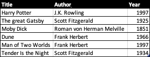
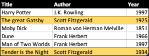
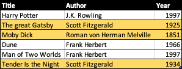
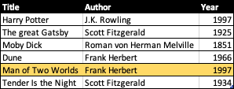
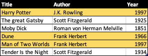
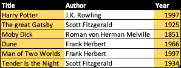
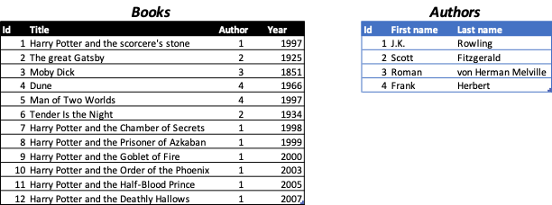

- [SQL](#sql)
- [Databases](#databases)
  - [SQLite](#sqlite)
  - [Performing SQL statements](#performing-sql-statements)
  - [Queries](#queries)
  - [Updates](#updates)
  - [Delete](#delete)
  - [Foreign Keys](#foreign-keys)
    - [Applying the changes to our `books`
      table](#applying-the-changes-to-our-books-table)
  - [Joining tables](#joining-tables)
  - [Vulnerabilities](#vulnerabilities)
- [Creating a Django project](#creating-a-django-project)
  - [Models](#models)
  - [Working with the db](#working-with-the-db)
  - [Admin](#admin)
  - [Displaying the sites](#displaying-the-sites)
- [User authentication](#user-authentication)
  - [urls](#urls)
  - [views.py](#views.py)
  - [login.html](#login.html)
  - [index.html](#index.html)

# SQL

In the previous section, we have only saved data in lists and
dictionaries during runtime. This caused us to lose all the data every
time the server restarted.

To *persistently* save data, we will take a look at how to work with
relational databases and use SQL to efficiently save and retrieve this
information.

# Databases

Relational databases allow us to store our data in the form of tables.
Every table has a fixed number of *columns* and a variable number of
*rows*.

Examples of relational databases include
[MySQL](https://www.mysql.com/de/),
[PostgreSQL](https://www.postgresql.org),
[SQLite](https://www.sqlite.org/index.html) and
[Oracle](https://www.oracle.com/database/). Next to relational databases
there exist [other
databases](https://www.enterpriseappstoday.com/business-intelligence/5-alternatives-to-the-traditional-relational-database.html)
to . Depending on the different of an application, different types of
databases might be more suitable than others. Since Django has SQLite
built-in however, we will be focusing on that.

## SQLite

Databases in SQLite are saved in files. Within such a file we can create
multiple tables and perform queries on them.

The columns of a table may be expected to only contain values of a
certain type, sometimes also referred to as [type
affinity](https://www.sqlite.org/datatype3.html#type_affinity). Compared
to other relational databases, SQLite offers only a small number of
different types for columns:

- `TEXT`: a string
- `NUMERIC`: generic number representation, i.e., for dates or boolean
  values
- `INTEGER`: whole numbers (-2, -1, 0, 1, 2, …)
- `REAL`: real numbers (0.25, 9e10, 1, 3.141, …)
- `BLOB`: “Binary Large Object”, binary data (i.e., for images, pdfs,
  encrypted messages, …)

## Performing SQL statements

We can use the Terminal or any external UI-tool such as
[SQLiteBrowser](https://sqlitebrowser.org/dl/) to work on a SQLite
database file. In the Terminal, we may do the following (note that in
SQL, “–” symbolizes a comment).

``` sql
-- create relational database file
$ touch courses.sqlite3

-- enter SQLite prompt
$ sqlite3 courses.sqlite3
SQLite version 3.39.5 2022-10-13 14:58:05
Enter ".help" for usage hints.

-- Create a new table
CREATE TABLE books(
    id INTEGER PRIMARY KEY AUTOINCREMENT,
    title TEXT NOT NULL,
    author TEXT NOT NULL,
    year INTEGER NOT NULL
);

-- List all tables
.tables

-- insert values
INSERT INTO books (title, author, year) VALUES ("Harry Potter", "J.K. Rowling", 1997);
INSERT INTO books (title, author, year) VALUES ("The great Gatsby", "Scott Fitzgerald", 1925);
INSERT INTO books (title, author, year) VALUES ("Moby Dick", "Roman von Herman Melville", 1851);
INSERT INTO books (title, author, year) VALUES ("Dune", "Frank Herbert", 1966);
INSERT INTO books (title, author, year) VALUES ("Man of Two Worlds", "Frank Herbert", 1997);
INSERT INTO books (title, author, year) VALUES ("Tender Is the Night", "Scott Fitzgerald", 1934);

-- list all entries
SELECT * FROM books;

-- make output more pretty
.mode columns
.headers yes

SELECT * FROM books;
-- id  title                author                     year
-- --  -------------------  -------------------------  ----
-- 1   Harry Potter         J.K. Rowling               1997
-- 2   The great Gatsby     Scott Fitzgerald           1925
-- 3   Moby Dick            Roman von Herman Melville  1851
-- 4   Dune                 Frank Herbert              1966
-- 5   Man of Two Worlds    Frank Herbert              1997
-- 6   Tender Is the Night  Scott Fitzgerald           1934
```

## Queries

The `WHERE` clause is used to filter the rows of a table. Consider the
table from before, which looks something like this (note, the id is left
out).



We may filter the rows as follows.

<details>
<summary>
`SELECT * FROM books WHERE author = "Scott Fitzgerald";`
</summary>

</details>
<details>
<summary>
`SELECT * FROM books WHERE year < 1950;`
</summary>

</details>
<details>
<summary>
`SELECT * FROM books WHERE year > 1970 AND author = "Scott Fitzgerald";`
</summary>

</details>
<details>
<summary>
`SELECT * FROM books WHERE year > 1970 OR author = "Scott Fitzgerald";`
</summary>

</details>

We can also seep out individual columns.

<details>
<summary>
`SELECT title, year FROM books;`
</summary>

</details>

Some other clauses include

``` sql
-- Similar to python's IN expression
SELECT * FROM books WHERE author IN ("Scott Fitzgerald", "J.K. Rowling");

-- Wild-card, find books that start with a T, followed by anything
SELECT * FROM books WHERE title LIKE "T%";

-- Get the average of all the numbers in the year column
SELECT AVG(year) FROM books;

-- Find latest book publication from each author
SELECT author, MAX(year) FROM books GROUP BY author;

-- Order them by their title and give us the first three results
-- (here it returns the books Dune, Harry Potter and Man of Two Worlds)
SELECT * FROM books ORDER BY title LIMIT 3;
```

## Updates

An example of using `UPDATE` to change the value of a cell. Note that if
the `WHERE` clause returns more than one row, it will change the value
for each filtered row.

``` sql
UPDATE books
  SET title = "Harry Potter and the scorcerer's stone"
  WHERE id = 1;
```

## Delete

An example of using `DELETE` to delete one or more rows of data in our
table.

``` sql
DELETE FROM books WHERE year < 1950;
```

## Foreign Keys

When adding more and more books, the same author may appear multiple
times.

``` python
INSERT INTO books (author, year, title) VALUES
  ("J.K. Rowling", 1998, "Harry Potter and the Chamber of Secrets"),
  ("J.K. Rowling", 1999, "Harry Potter and the Prisoner of Azkaban"),
  ("J.K. Rowling", 2000, "Harry Potter and the Goblet of Fire"),
  ("J.K. Rowling", 2003, "Harry Potter and the Order of the Phoenix"),
  ("J.K. Rowling", 2005, "Harry Potter and the Half-Blood Prince"),
  ("J.K. Rowling", 2007, "Harry Potter and the Deathly Hallows")
;
```

This form of redundancy could cause issues. For one, we’re just wasting
space. Secondly, we have to be very sure that there’s no typo when
entering the author’s name. Lastly, if we want to update the name of an
author, we need to be sure to update *all* rows containing that author’s
name.

What we want to apply when structuring databases is the concept of
[Single Source of
Truth](https://en.wikipedia.org/wiki/Single_source_of_truth).

Here, it makes sense to introduce a table `authors`. Then, in our
`books` table, for any book we want the `author` cell to point to the
corresponding id of the author in the `authors` table.



Here, the Author column contains so-called *foreign keys*. It is a
constraint that specifies that any value in that column must be linked
to the Ids of the Authors table.

In [SQLite](https://www.sqlite.org/foreignkeys.html), we can add the
constraint like this.

``` sql
CREATE TABLE authors(
    id INTEGER PRIMARY KEY AUTOINCREMENT,
    first_name TEXT NOT NULL,
    last_name TEXT NOT NULL
);

-- note that the books column doesn't "exist" in this context
CREATE TABLE books(
    id INTEGER PRIMARY KEY AUTOINCREMENT,
    title TEXT NOT NULL,
    author_id TEXT NOT NULL,
    year INTEGER NOT NULL,
    FOREIGN KEY(author) REFERENCES authors(id)
);
```

Now, any time we add a book, giving it an `author_id` that does not
exist in the `authors` table will throw an error.

It is also sensible to add a `CASCADE` action to our books table.

``` sql
CREATE TABLE books(
    -- ...
    FOREIGN KEY(author) REFERENCES authors(id) ON DELETE CASCADE
)
```

This implies that, if an author in the `authors` table is deleted, it
should automatically delete all books from that author as well.

### Applying the changes to our `books` table

Unfortunately, we have already created a `book` table, and altering it
in SQLite the way we want to isn’t quite as straight-forward as one
would assume. If you feel motivated to do it in SQL anyways, you can
follow the instructions below.

<details>
<summary>
Instructions
</summary>

``` sql
-- Add authors to the list of authors
-- (first_name will contain entire name, last_name an empty string for simplicity's sake)
INSERT INTO authors(first_name, last_name) SELECT DISTINCT author,'' FROM books;

-- In SQLite, foreign key constraints cannot be added after the table has been created (https://stackoverflow.com/q/1884818).
-- Therefore, we'll need to create a new table
ALTER TABLE books RENAME TO books_old;
CREATE TABLE books(
    id INTEGER PRIMARY KEY AUTOINCREMENT,
    title TEXT NOT NULL,
    author_id TEXT NOT NULL,
    year INTEGER NOT NULL,
    FOREIGN KEY(author_id) REFERENCES authors(id)
);

-- transfer rows from books_old to books, replace author with corresponding author_id
INSERT INTO books (id, title, year, author_id)
  SELECT id, title, year, (SELECT authors.id FROM authors WHERE authors.first_name = books_old.author)
  FROM books_old;

-- delete old table
DROP TABLE books_old;
```

</details>

## Joining tables

Our `books` table now contains a reference to the `authors` table. To
present users with the author name for each book, we can join them
together.

``` sql
SELECT * FROM books JOIN authors ON books.author_id = authors.id;
```

<details>
<summary>
Output
</summary>

    id  title                                      author_id  year  id  first_name  last_name          
    --  -----------------------------------------  ---------  ----  --  ----------  -------------------
    1   Harry Potter and the scorcere's stone      1          1997  1   J.K.        Rowling            
    2   The great Gatsby                           2          1925  2   Scott       Fitzgerald         
    3   Moby Dick                                  3          1851  3   Roman       von Herman Melville
    4   Dune                                       4          1966  4   Frank       Herbert            
    5   Man of Two Worlds                          4          1997  4   Frank       Herbert            
    6   Tender Is the Night                        2          1934  2   Scott       Fitzgerald         
    7   Harry Potter and the Chamber of Secrets    1          1998  1   J.K.        Rowling            
    8   Harry Potter and the Prisoner of Azkaban   1          1999  1   J.K.        Rowling            
    9   Harry Potter and the Goblet of Fire        1          2000  1   J.K.        Rowling            
    10  Harry Potter and the Order of the Phoenix  1          2003  1   J.K.        Rowling            
    11  Harry Potter and the Half-Blood Prince     1          2005  1   J.K.        Rowling            
    12  Harry Potter and the Deathly Hallows       1          2007  1   J.K.        Rowling

</details>

Some columns now become redundant. In place of `*`, we can specify which
columns from `books` and `authors` we want to keep.

``` sql
SELECT books.title, authors.first_name, authors.last_name, books.year FROM books JOIN authors ON books.author_id = authors.id;
```

<details>
<summary>
Output
</summary>

    title                                      first_name  last_name            year
    -----------------------------------------  ----------  -------------------  ----
    Harry Potter and the scorcere's stone      J.K.        Rowling              1997
    The great Gatsby                           Scott       Fitzgerald           1925
    Moby Dick                                  Roman       von Herman Melville  1851
    Dune                                       Frank       Herbert              1966
    Man of Two Worlds                          Frank       Herbert              1997
    Tender Is the Night                        Scott       Fitzgerald           1934
    Harry Potter and the Chamber of Secrets    J.K.        Rowling              1998
    Harry Potter and the Prisoner of Azkaban   J.K.        Rowling              1999
    Harry Potter and the Goblet of Fire        J.K.        Rowling              2000
    Harry Potter and the Order of the Phoenix  J.K.        Rowling              2003
    Harry Potter and the Half-Blood Prince     J.K.        Rowling              2005
    Harry Potter and the Deathly Hallows       J.K.        Rowling              2007

</details>

## Vulnerabilities

SQL injection is one of the most predominant sources of vulnerabilities
on servers. If some SQL query is dependent on user input, upmost caution
must be held to sanitize their input.

Suppose we have a login form. One (bad) way to check if the username and
password is correct is as follows.

``` python
def can_login(username, password):
    sql_statement = f'SELECT * FROM users WHERE username="{username}" AND password="{password}"'
    user = execute_sql_statement(sql_statement)
    return len(user) > 0
```

Now, as user may enter the following string into the username box…

    Henry"; --

… resulting in the following sql statement.

``` sql
SELECT * FROM users WHERE username="Henry"; --" AND password="{password}"
```

Hence, the user can now login as `Henry` without knowing their password.

In modern system, one should always rely on libraries that saves us from
having to handle sql statements directly.

# Creating a Django project

`django-admin startproject project`

`python3 manage.py startapp grading`

project.urls

``` python
urlpatterns = [
    path('', include('grading.urls')),
    path('admin/', admin.site.urls),
]
```

grading.urls

``` python
urlpatterns = [
    path('', views.index, name='index'),
    path('pset/<int:pset_id>', views.pset, name='pset'),
    path('pset/<int:pset_id>/add', views.pset, name='pset'), # maybe
]
```

## Models

`python3 manage.py makemigrations`

`python3 manage.py migrate`

``` python
from django.db import models
from django.forms import ModelForm
from django.core.exceptions import ValidationError

class ProblemSet(models.Model):
    name = models.CharField(max_length=100)
    due = models.DateField()

    def __str__(self):
        return self.name

class Question(models.Model):
    description = models.TextField()
    score = models.IntegerField()
    problem_set = models.ForeignKey(ProblemSet, on_delete=models.CASCADE, related_name='questions')

    def __str__(self):
        return self.description

class QuestionForm(ModelForm):
    class Meta:
        model = Question
        fields = [ 'description', 'score', 'problem_set' ]

class Student(models.Model):
    name = models.CharField(max_length=100)
    problem_sets = models.ManyToManyField(ProblemSet, related_name='students')

    def __str__(self):
        return self.name
```

## Working with the db

`python3 manage.py shell`

``` python
from grading.models import *

pset1 = ProblemSet(name='Problem set 5', due='2023-04-02')
pset1.save()
q1 = Question(description='Describe polyphornism', score=4, problem_set=pset1)
q1.save()
q2 = Question(description='What is SQL', score=3, problem_set=pset1)
q2.save()

ProblemSet.objects.all()
```

## Admin

`python3 manage.py createsuperuser`

``` python
from django.contrib import admin
from .models import *

# Register your models here.
class ProblemSetAdmin(admin.ModelAdmin):
    list_display = ('id', 'name', 'due')

class QuestionAdmin(admin.ModelAdmin):
    list_display = ('id', 'description', 'score', 'problem_set')

class StudentAdmin(admin.ModelAdmin):
    filter_horizontal = ('problem_sets',)

admin.site.register(ProblemSet, ProblemSetAdmin)
admin.site.register(Question, QuestionAdmin)
admin.site.register(Student, StudentAdmin)
```

## Displaying the sites

views.py

``` python
from django.shortcuts import render, redirect
from .models import *

# Create your views here.
def index(request):
    return render(request, 'grading/index.html', {
        'psets': ProblemSet.objects.all()
    })

def pset(request, pset_id):
    if request.method == 'POST':
        form = QuestionForm(request.POST)
        if form.is_valid():
            form.save()
            return redirect('pset', pset_id)

    pset = ProblemSet.objects.get(pk=pset_id)
    return render(request, 'grading/pset.html', {
        'pset': pset,
        'questions': pset.questions.all(),
        'form': QuestionForm()
    })
```

index.html

``` html



<h1>Problem sets</h1>
<ul>
    
        <li><a href="">{{ pset }}</a></li>
    
</ul>

```

pset.html

``` html



    <a href="">Home</a><br>
    <h1>{{ pset.name }}</h1>
    <p>This problem set is due {{ pset.due }}</p>
    <h2>Questions</h2>
    <ol>
        
            <li>{{ question }}</li>
        
    </ol>

    <h2>Add question</h2>
    <form action="" method="POST">
        
        {{ form }}
        <button type="submit">Submit new question</button>
    </form>

```

# User authentication

Create new app

## urls

``` python
from django.urls import path

from . import views

urlpatterns = [
    path("", views.index, name="index"),
    path("login", views.login_view, name="login"),
    path("logout", views.logout_view, name="logout")
]
```

## views.py

``` python
from django.contrib.auth import authenticate, login, logout
from django.http import HttpResponse, HttpResponseRedirect
from django.shortcuts import render
from django.urls import reverse

# Create your views here.
def index(request):
    if not request.user.is_authenticated:
        return HttpResponseRedirect(reverse("login"))
    return render(request, "users/user.html")

def login_view(request):
    if request.method == "POST":
        username = request.POST["username"]
        password = request.POST["password"]
        user = authenticate(request, username=username, password=password)
        if user is not None:
            login(request, user)
            return HttpResponseRedirect(reverse("index"))
        else:
            return render(request, "users/login.html", {
                "message": "Invalid credentials."
            })
    else:
        return render(request, "users/login.html")

def logout_view(request):
    logout(request)
    return render(request, "users/login.html", {
        "message": "Logged out."
    })
```

## login.html

``` html




    <h1>Log In</h1>

    
        <div>{{ message }}</div>
    

    <form action="" method="post">
        
        <input type="text" name="username" placeholder="Username">
        <input type="password" name="password" placeholder="Password">
        <input type="submit" value="Login">
    </form>

```

## index.html

``` html




    <h1>Welcome, {{ request.user.first_name }}</h1>

    <ul>
        <li>Username: {{ request.user.username }}</li>
        <li>Email: {{ request.user.email }}</li>
    </ul>

    <a href="">Log Out</a>

```
