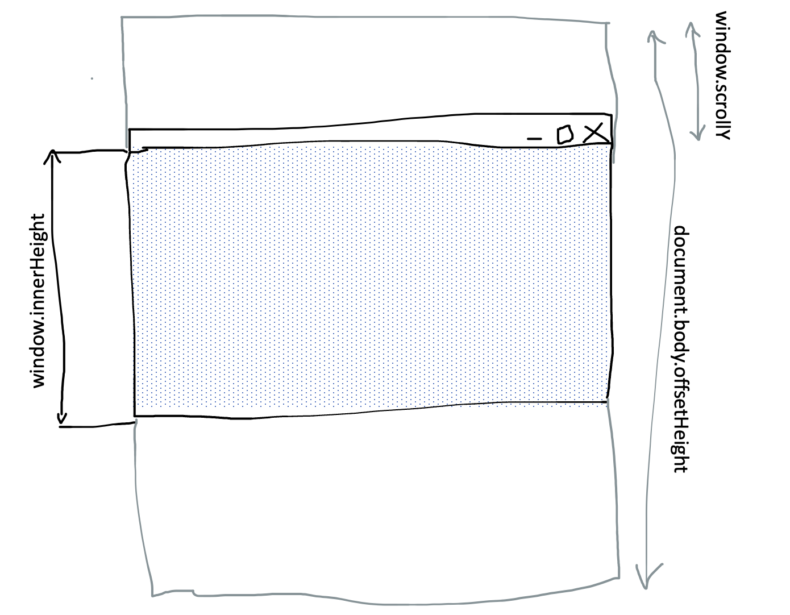
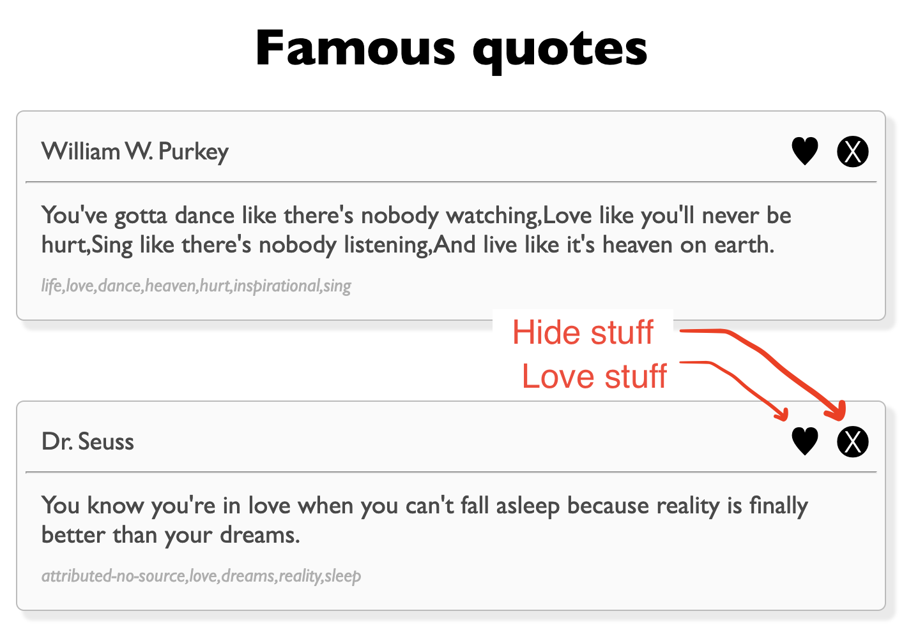
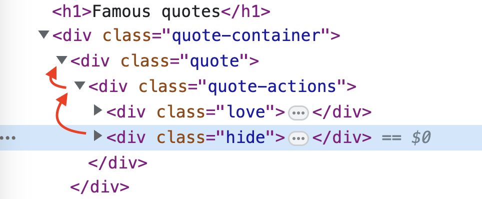

Dynamic user interfaces
================

- [Dynamic User Interfaces](#dynamic-user-interfaces)
- [1 Single Page Applications](#1-single-page-applications)
  - [1.1 Intuitive steps to create an SPA](#11-intuitive-steps-to-create-an-spa)
  - [1.2 Dynamically loading data](#12-dynamically-loading-data)
  - [1.3 Working with the URL](#13-working-with-the-url)
    - [1.3.1 Making sure that refresh works](#131-making-sure-that-refresh-works)
    - [1.3.2 Using models](#132-using-models)
    - [1.3.3 Endless scroll](#133-endless-scroll)
- [2 CSS animation](#2-css-animation)
  - [2.1 Keyframes](#21-keyframes)
  - [2.2 Controling the animation play state](#22-controling-the-animation-play-state)
  - [2.3 Applying the animation](#23-applying-the-animation)
- [3 Introduction to react (next time)](#3-introduction-to-react-next-time)

[Click here](https://github.com/DauphineWeb/SPA) to view the project accompanying this README file.

Here, we will look at how we can make a user interface more dynamic and
intuitive. First, we use base JavaScript functionality to dynamically
load new content from our Django server and incorporate animations to
make it more pleasing to look at. Then, we will explore ways in which a
front-end framework such as React may help us better streamline this
process by using components and states (except, we are not, this will be a topic for another day).

# 1 Single Page Applications

In Django, we have used [template
inheritance](https://github.com/DauphineWeb/ProgrammationWeb2023/tree/main/03-08%20Django#47-blocks-or-template-inheritance)
in cases where the overall structure of a site stays the same and only
the content changes. Since we always serve the entire website, it seems
wasteful to send that bytes of data that essentially never change.

With [single-page
applications](https://en.wikipedia.org/wiki/Single-page_application)
(SPA), we can essentially achieve in the front-end what template
inheritance has done for us in the back-end. The user is given the
essential structure of a website, but this time the browser pulls in the
data from the server and uses JavaScript to dynamically fill the DOM.

## 1.1 Intuitive steps to create an SPA

First, let’s create a basic html file that lets the user choose between
three different pages. Feel free to try it
[here](https://codepen.io/DauphineWeb/pen/QWZKryV).

``` html
<!DOCTYPE html>
<html lang="en">
  <head>
    <title>SPA</title>
    <style>[id^="page"] { display: none; }</style>
    <script>
      var pages;
      // function to hide all pages, then show the one requested
      function showPage(page) {
        pages.forEach(page => {
          page.style.display = 'none';
        });
        document.getElementById(page).style.display = 'block';
      }
      // after DOM is loaded, gather all page elements and listen to click events
      document.addEventListener('DOMContentLoaded', function() {
        pages = document.querySelectorAll('[id^="page"]');
        document.querySelectorAll('button').forEach(button => {
          button.onclick = function() {
            // recall that this.dataset acquires the data-attributes of an element
            showPage(this.dataset.page);
          }
        });
      })
    </script>
  </head>
  <body>
    <button data-page="page1">Page 1</button>
    <button data-page="page2">Page 2</button>
    <button data-page="page3">Page 3</button>
    <div id="page1"><h1>This is page 1</h1></div>
    <div id="page2"><h1>This is page 2</h1></div>
    <div id="page3"><h1>This is page 3</h1></div>
  </body>
</html>
```

`[id^="page"]` lets us select all elements for which the `id` *starts*
with the word `"page"`.

Each button contains a [`data`
attribute](https://developer.mozilla.org/en-US/docs/Learn/HTML/Howto/Use_data_attributes)
containing the `id` of a page we may want to show.

This already works great and gives the user the ability of switching
between different contents of a page without having to load the entire
html each time. But, of course, there are some issues that we need to
deal with.

1.  All data has to be there. This may be wasteful if the user never
    intends to view all pages, or even plain impossible if there is just
    too much data to transmit.
2.  The url doesn’t change. There is no way to open or share any of the
    pages without having to navigate the website manually.  
    This also implies that there is no backward and forward navigation.
    If a user clicks on page 1 and then page 2, clicking the browser’s
    back button does not take the user to page 1.
3.  Switching between pages is a little jarring. Without any clear
    transitions or clearly discernible content, it may take a few
    moments for the user to realize that the content has changed.

We will look at how we can mitigate these issues next.

## 1.2 Dynamically loading data

In [problem set
3](https://github.com/DauphineWeb/ProgrammationWeb2023/blob/main/Problem%20Sets/Problem%20Set%203.pdf),
we’ve already discovered that we can use `fetch()` to dynamically fetch
data from a server while the page is loaded. In our Django application
we could then for instance provide an endpoint for the client to
communicate with.

In the lecture’s `lorem` example, we create a service that simply
returns text.

<details>
<summary>
Project and application setup
</summary>

1.  Run `django-app startproject spa`, `cd spa` and
    `python3 manage.py startapp lorem`.
2.  Add `lorem` to the list of installed applications in
    `spa/settings.py`.
3.  Add `path('lorem/', include('lorem.urls'))` to `spa/urls.py`.
4.  Add the following to `lorem/urls.py`:

``` python
from django.urls import path
from . import views

app_name = 'lorem'

urlpatterns = [
    path('', views.index, name='index'),
    path('page/<int:page_nr>', views.page, name='page')
]
```

5.  For template inheritance, create a file called
    `lorem/templates/lorem/layout.html`

``` html
<!DOCTYPE html>
<html lang="en">
<head>
    <meta charset="UTF-8">
    <meta http-equiv="X-UA-Compatible" content="IE=edge">
    <meta name="viewport" content="width=device-width, initial-scale=1.0">
    
    <script src=""></script>
    <link rel="stylesheet" href="https://unpkg.com/mvp.css@1.12/mvp.css"> 
    <style>
        body {
            max-width: 1024px;
            margin: 0 auto;
            padding: 0 50px;
        }
    </style>
    <title>Lorem</title>
</head>
<body>
    
    
</body>
</html>
```

</details>

For simplicity’s sake we will ignore any database functionality for now
and only return some static text from a list of strings.

``` python
from django.shortcuts import render
from django.http import Http404, HttpResponse

pages = ['Text 1', 'Text 2', 'Text 3']

def index(request):
    return render(request, 'lorem/index.html')

def page(request, page_nr):
    try:
        return HttpResponse(pages[page_nr])
    except IndexError:
        raise Http404()
```

Now, in the index page, there will be only one `<p>`-tag where all the
content goes. As for the buttons, their `data-page` attributes now
contain the exact url of where to get the page content from.

``` html


<h1>Text Viewer</h1>
<button data-page="">Page 1</button>
<button data-page="">Page 2</button>
<button data-page="">Page 3</button>
<p id="content"></p>

```

<details>
<summary>
The resulting html
</summary>

``` html
<!DOCTYPE html>
<html lang="en">
<head>
    <!-- ... -->
</head>
<body>
    <h1>Text Viewer</h1>
    <button data-site="/lorem/page-text/0">Page 1</button>
    <button data-site="/lorem/page-text/1">Page 2</button>
    <button data-site="/lorem/page-text/2">Page 3</button>
    <p id="content"></p>
</body>
</html>
```

</details>

Similar to problem set 3, `showPage()` will now fetch the relevant text
instead of hiding and showing different page `div`s.

``` js
var content;

function showPage(page) {
    content.innerText = '...';
    fetch(page).then((response) => {
        if(response.ok) {
            return response.text();
        } else {
            throw Error(response.status + ': ' + response.statusText);
        }
    }).then((text) => {
        content.innerText = text;
    }).catch((error) => {
        content.innerText = error;
    })
}

document.addEventListener('DOMContentLoaded', function () {
    content = document.getElementById('content');
    document.querySelectorAll('button').forEach(button => {
        button.onclick = function () {
            showPage(this.dataset.page);
        }
    });
})
```

## 1.3 Working with the URL

[JavaScript’s History
API](https://developer.mozilla.org/en-US/docs/Web/API/History_API) lets
us handle the navigation between different sites. Some of its most
important functionalities include:

``` js
// change url (without refreshing the page)
history.pushState({state_object: object}, title, url);

// be notified when user goes back one page
// here we would use the state to manually revert changes made previously through pushState()
window.addEventListener('popstate', function(event) { console.log(event.state); });

// navigate one page back
history.back();

// navigate one page forward
history.forward();
```

(see more on [working with the
api](https://developer.mozilla.org/en-US/docs/Web/API/History_API/Working_with_the_History_API)
and
[popstate](https://developer.mozilla.org/en-US/docs/Web/API/Window/popstate_event))

Now, we change our `onclick` function such that the currently viewed
page is correctly represented in the URL.

``` js
button.onclick = function() {
    let site = this.dataset.site;
    
    showPage(site);
    let parts = site.split('/');
    history.pushState({ site: site }, '', '/lorem/page/' + parts[parts.length - 1]);
};
```

Now, clicking on the first button should change the url to
`localhost:8000/lorem/page/0`, on the second button to
`.../lorem/page/1` and so on. Notice however that the url
`/lorem/page/<int>` does not actually exist on the server side.

Before we fix that, we add a `'popstate'` listener. If the user presses
the browser’s back button, we listen for the event and update the
content accordingly.

``` js
window.addEventListener('popstate', event => {
    showPage(event.state.site);
});
```

### 1.3.1 Making sure that refresh works

First, we add the `page/<int:page_nr>` path to our `urlpatterns` list.
Notice that it also points to the `views.index` function. Since we pass
in a `page_nr` parameter, the index path `path('', ...)` needs to
updated to supply a default value for `'page_nr'`.

``` python
# lorem/urls.py
# ...

urlpatterns = [
    path('', views.index, { 'page_nr': None }, name='index'),
    path('page/<int:page_nr>', views.index, name='page'),
    path('page-text/<int:page_nr>', views.page_text, name='page_text'),
]
```

In our `views.py`, the index path now accepts a path parameter and
passes it to our index template file.

``` python
# lorem/views.py
# ...

def index(request, page_nr):
    return render(request, 'lorem/index.html', { 'page_nr': page_nr })
```

In our template file, we can, quite hackishly, add a simple script tag
that defines a global variable for the current page. We do this because
there is no convenient way to pass in the

``` html
<!-- lorem/templates/lorem/index.html -->


<h1>Text Viewer</h1>
<button data-page="">Page 1</button>
<button data-page="">Page 2</button>
<button data-page="">Page 3</button>
<p id="content"></p>
<script>var initialPageNr = "{{ page_nr }}"</script>

```

In our js, the only thing left now is to load the requested page if it
was set after the DOM is loaded.

``` js
// lorem/static/lorem/script.js

document.addEventListener('DOMContentLoaded', function() {
    // ...
    // show initial page
    if(initialPageNr !== 'None') {
        showPage('/lorem/page-text/' + initialPageNr);
    }
})
```

### 1.3.2 Using models

<details>
<summary>
Setting up the quotes project
</summary>

1.  Run `python3 manage.py startapp quotes`.
2.  Add `quotes` to the list of apps in `spa/settings.py`.
3.  Add `path('quotes/', include('quotes.urls'))` to the list of urls in
    `spa/urls.py`.
4.  Add the following two paths to `quotes/urls.py`.

``` python
from django.urls import path
from . import views

app_name = 'quotes'

urlpatterns = [
    path('', views.index, name='index'),
    path('fetch-quotes/', views.quotes_json, name='fetch_quotes'),
]
```

5.  Create a basic `quotes/views.py` file to handle these urls.

``` python
from django.http import JsonResponse
from django.shortcuts import render
from django.forms.models import model_to_dict
from .models import Quote

def index(request):
    return render(request, 'quotes/index.html')

def quotes_json(request):
    # empty json response for now
    return JsonResponse({})
```

6.  Add a `quotes/templates/quotes/index.html` file. It will also load a
    JavaScript and css file on the go.

``` html
<!DOCTYPE html>
<html lang="en">
<head>
    <meta charset="UTF-8">
    <meta http-equiv="X-UA-Compatible" content="IE=edge">
    <meta name="viewport" content="width=device-width, initial-scale=1.0">
    
    <link rel="stylesheet" href="">
    <script src=""></script>
    <title>Quotes</title>
</head>
<body>
    <h1>Famous quotes</h1>
    <div class="quote-container"></div>
</body>
</html>
```

7.  Add a static `quotes/static/quotes/styles.css` file to make our
    quotes look nice.

``` css
body {
    max-width: 1024px;
    margin: 0 auto;
    padding: 50px;
    font-family: 'Gill Sans', 'Gill Sans MT', Calibri, 'Trebuchet MS', sans-serif;
}

h1 {
    text-align: center;
}

.quote {
    position: relative;
    border: 1px solid #BBB;
    border-radius: 5px;
    background-color: #FAFAFA;
    box-shadow: 5px 5px 2px 1px #EAEAEA;
    margin-bottom: 50px;
    padding: 5px;
}

.quote > p {
    margin: 10px;
    color: #494949;
}

.quote > .categories {
    color: #AEAEAE;
    font-style: italic;
    font-size: 12px;
}
```

8.  Similar to before, we start with a basic
    `quotes/static/quotes/script.js` file that fetches current quotes.

``` js
let quoteContainer;

function fetchQuotes() {
    fetch('fetch-quotes/').then(response => {
        if(response.ok) {
            return response.json();
        } else {
            throw Error();
        }
    }).then(quotes => {
        // render quotes
        console.log(quotes)
    });
}

document.addEventListener('DOMContentLoaded', function() {
    quoteContainer = document.querySelector('.quote-container');
    
    fetchQuotes();
});
```

9.  Ready our models in `quotes/models.py` and run
    `python3 manage.py makemigrations` and `python3 manage.py migrate`.
    Data set for the quotes used in lecture were retrieved from
    [kaggle.com](https://www.kaggle.com/datasets/manann/quotes-500k?resource=download).

``` python
from django.db import models

class Author(models.Model):
    name = models.CharField(max_length=255, unique=True)
    def __str__(self):
        return self.name

class Category(models.Model):
    name = models.CharField(max_length=255, unique=True)
    def __str__(self):
        return self.name

class Quote(models.Model):
    content = models.TextField()
    author = models.ForeignKey(Author, on_delete=models.CASCADE, related_name='quotes')
    categories = models.ManyToManyField(Category, related_name='quotes')
    def __str__(self):
        return f"{self.content[:50]}... - {self.author.name}"
```

</details>

If we want to return objects from a model instead, we can return a
`JsonResponse` using the dictionary representation of those objects.
While we create our json object manually, we could also use the function
`model_to_dict()` to automatically turn a model into a serializable
dictionary object.

Note that we have the following relationships between our tables:

- `Quote *<-->1 Author` (author can have many quotes, a quote has one
  foreign key to an author)
- `Quote *<-->* Category` (a quote can include many categories, a
  category can be assigned to multiple quotes)

To combine the information from multiple tables, we use
[`select_related()`](https://docs.djangoproject.com/en/4.2/ref/models/querysets/#select-related)
to fetch objects with a foreign key (one-to-many or one-to-one
relationship) and
[`prefetch_related()`](https://docs.djangoproject.com/en/4.2/ref/models/querysets/#prefetch-related)
to fetch objects from a many-to-many relationship.

``` python
# quote/views.py
from django.http import JsonResponse
from django.shortcuts import render
from django.forms.models import model_to_dict # not used here
from .models import Quote

def index(request):
    return render(request, 'quotes/index.html')

def quotes_json(request):
    # fetch the first 20 quotes
    quotes = Quote.objects.select_related('author').prefetch_related('categories')[:20]

    quote_list = [{
        'content': quote.content,
        'author': quote.author.name,
        'category': [category.name for category in quote.categories.all()]
    } for quote in quotes]

    return JsonResponse(quote_list, safe=False)
```

<details>
<summary>
A sample JSON object
</summary>

``` python
[
  {
    "content": "I'm selfish, impatient and a little insecure. I make mistakes, I am out of control and at times hard to handle. But if you can't handle me at my worst, then you sure as hell don't deserve me at my best.",
    "author": "Marilyn Monroe",
    "category": [ "attributed-no-source", "best", "life", "love", "mistakes", "out-of-control", "truth", "worst" ]
  },
  {
    "content": "You've gotta dance like there's nobody watching,Love like you'll never be hurt,Sing like there's nobody listening,And live like it's heaven on earth.",
    "author": "William W. Purkey",
    "category": [ "life", "love", "dance", "heaven", "hurt", "inspirational", "sing" ]
  },
  {
    "content": "You know you're in love when you can't fall asleep because reality is finally better than your dreams.",
    "author": "Dr. Seuss",
    "category": [ "attributed-no-source", "love", "dreams", "reality", "sleep" ]
  },
  {
    "content": "A friend is someone who knows all about you and still loves you.",
    "author": "Elbert Hubbard",
    "category": [ "love", "friend", "friendship", "knowledge" ]
  },
  {
    "content": "Darkness cannot drive out darkness: only light can do that. Hate cannot drive out hate: only love can do that.",
    "author": "Martin Luther King Jr., A Testament of Hope: The Essential Writings and Speeches",
    "category": [ "love", "inspirational", "darkness", "drive-out", "hate", "light", "peace" ]
  },
  {
    "content": "We accept the love we think we deserve.",
    "author": "Stephen Chbosky, The Perks of Being a Wallflower",
    "category": [ "love", "inspirational" ]
  },
  # ...
]
```

</details>

Many projects are built around the idea that a majority of the
communication between a client and a server is done through JSON object.
In these use-cases, it makes sense to think about and design a
comprehensive
[REST-API](https://fr.wikipedia.org/wiki/Representational_state_transfer),
an interface to the server that solely relies on JSON objects. While we
are able to create our own JSON objects in Django, solutions such as the
[Django REST framework](https://www.django-rest-framework.org) exist
that perform many of the manual database-querying and
data-transformation tasks we have done before.

Finally, in our JavaScript file, we can fetch the json object and add
these to the DOM.

``` js
let quoteContainer;

function fetchQuotes() {
    fetch(`fetch-quotes/?offset=${offset}&limit=${limit}`)
    .then(response => response.json())
    .then(quotes => {
      quotes.forEach(quote => {
        // create <div class="quote"></div> element
        const quoteElement = document.createElement('div');
        quoteElement.classList.add('quote');
        quoteElement.innerHTML = `
            <p>${quote.author}</p>
            <hr>
            <p>${quote.content}</p>
            <p class="categories">${quote.categories}</p>
        `;
        quoteContainer.appendChild(quoteElement);
      });
    });
}
// ...
```

Similar to REST APIs, [GraphQL](https://graphql.org) is a protocol for
client-server communication through JSON requests (in Django one could
use
[graphene-django](https://github.com/graphql-python/graphene-django)).
Whereas REST-APIs are rather static in what the structure of the
responses look like, GraphQL allows the client to specify the values
they actually need. While this reduces the amount of data that has to be
transferred, it may involve more computation on the side of the server.

### 1.3.3 Endless scroll

Many social media sites implement an endless scroll system. Once the
user reaches the bottom of the page, new content is loaded
automatically. As a reference, you are obligated to view this [endless
horse](endless.horse) and scroll until you reach the horse’s feet.

Using JavaScript, we can listen for the scroll event and be notified
when the user reaches (or comes close to) the bottom of the page. To
better visualize how we reach such a state, consider the following
professional drawing.



These three variables are relevant:

- `document.body.offsetHeight`: the height of the entire `<body>` tag.
- `window.innerHeight`: the height of the view port, or, the height of
  the browser window (minus url and menu bar).
- `window.scrollY`: the current scroll position.

Using this information, we can estimate that that the user scrolled all
the way to the bottom once `window.innerHeight + window.scrollY` is
equal to `document.body.offsetHeight`. Therefore, we can add the
following function. Further down, we then listen to the
`window.onscroll` event to make

``` js
// quotes/static/quotes/script.js

function userReachedBottom() {
    return window.scrollY + window.innerHeight >= document.body.offsetHeight - 25;
}
```

Right now, `fetch-quotes` only ever returns the first 20 entries. We
will include the GET request parameters `offset` and `limit` to change
that range.

``` python
# quotes/views.py

def quotes_json(request):
    offset = int(request.GET.get('offset', 0))
    limit = int(request.GET.get('limit', 20))
    quotes = Quote.objects.select_related('author').prefetch_related('categories')[offset:offset + limit]

    quote_list = [{
        'content': quote.content,
        'author': quote.author.name,
        'category': [category.name for category in quote.categories.all()]
    } for quote in quotes]

    return JsonResponse(quote_list, safe=False)
```

Now, the JavaScript only needs to keep track of which quotes have
already been loaded to know what to load next.

``` js
// quotes/static/quotes/script.js
let offset = 0;
const limit = 20;

function fetchQuotes() {
    fetch('fetch-quotes/?offset=' + offset + '&limit=' + limit).then(response => {
        // ...
        
    }).then(quotes => {
        // ...
        
        offset += limit;
    });
}
```

Lastly, we add a scroll listener that calls `fetchQuotes()` once the
user is near the bottom of the page.

``` js
// quotes/static/quotes/script.js

document.addEventListener('DOMContentLoaded', function() {
    // ...

    window.onscroll = function(event) {
        if(userReachedBottom()) {
            fetchQuotes();
        }
    }
});
```

<details>
<summary>
View entire JavaScript file
</summary>

``` js
let quoteContainer;
let offset = 0;
const limit = 20;

function fetchQuotes() {
    fetch('fetch-quotes/?offset=' + offset + '&limit=' + limit).then(response => {
        if(response.ok) {
            return response.json();
        } else {
            throw Error();
        }
    }).then(quotes => {
        quotes.forEach(quote => {
            const element = document.createElement('div');
            element.classList.add('quote');
            element.innerHTML = `
            <p>${quote.author}</p>
            <hr>
            <p>${quote.content}</p>
            <p class="categories">${quote.category}</p>
            `
    
            quoteContainer.appendChild(element);
        });

        offset += limit;
    });
}

function userReachedBottom() {
    return window.scrollY + window.innerHeight >= document.body.offsetHeight - 25;
}


document.addEventListener('DOMContentLoaded', function() {
    quoteContainer = document.querySelector('.quote-container');

    window.onscroll = function(event) {
        if(userReachedBottom()) {
            fetchQuotes();
        }
    }

    fetchQuotes();
});
```

</details>

# 2 CSS animation

We have seen how we can use [css transitions](https://developer.mozilla.org/en-US/docs/Web/CSS/CSS_Transitions/Using_CSS_transitions)
to create effects when some event on the site happens (see, i.e., the
hover effect [here](https://codepen.io/DauphineWeb/pen/BaqQmzo)). For
more complex animations, we can utilize [css animations](https://developer.mozilla.org/en-US/docs/Web/CSS/animation).

## 2.1 Keyframes

A animation is divided into blocks of keyframes. Each block defines,
what properties an element should have at what time of an animation.

``` css
@keyframes animation_name {
    from {
        /* styling at the beginning */
    }

    to {
        /* styling at the end */
    }
}
```

To include more keyframes, we can set percentiles.

``` css
@keyframes animation_name {
    0% {
        /* styling at the beginning */
    }

    25% {
        /* styling after 1/4 of the animation */
    }

    100% {
        /* styling at the end */
    }
}
```

To apply the animation to an element, we need to set the
`animation-name` and `animation-duration` properties. Try the animation
below [here](https://codepen.io/DauphineWeb/pen/ExdNbmp).

``` html
<!DOCTYPE html>
<html lang="en">
    <head>
        <title>Animate</title>
        <style>
            @keyframes grow {
                from {
                    font-size: 20px;
                }
                to {
                    font-size: 100px;
                }
            }

            h1 {
                animation-name: grow;
                animation-duration: 2s;
                animation-fill-mode: forwards;
            }
        </style>
    </head>
    <body>
        <h1>Welcome!</h1>
    </body>
</html>
```

There is a whole range of properties that influence the animation style.
You are encourage to look at the documentation from
[mozilla](https://developer.mozilla.org/en-US/docs/Web/CSS/animation?retiredLocale=de#constituent_properties)
(or any other tutorial website) on what each property does

``` css
h1 {
  animation-name: grow;
  animation-duration: 1s;
  animation-timing-function: ease-in;
  animation-delay: 1s;
  animation-iteration-count: 1;
  animation-direction: reverse;
  animation-fill-mode: both;
  animation-play-state: running;
  
  /* or just set animation property */
  animation: name duration timing-function delay iteration-count direction fill-mode;
  /* i.e. play grow animation once for two seconds */
  animation: grow 2s;
  /* i.e. play grow animation infinitely */
  animation: grow 1s linear infinite;
}
```

## 2.2 Controling the animation play state

The only problem now is that the animation plays right from the get-go.
To influence when and how an animation on an element plays, we can
access the `element.style` attribute of an element and set the play
state.

We start with a simple infinite rotation animation.

``` html
<!DOCTYPE html>
<html lang="en">
<head>
    <meta charset="UTF-8">
    <meta http-equiv="X-UA-Compatible" content="IE=edge">
    <meta name="viewport" content="width=device-width, initial-scale=1.0">
    <title>Spinner</title>
    <style>
        @keyframes spin {
            from {
                transform: rotate(0deg);
            }
        
            to {
                transform: rotate(360deg);
            }
        }
        
        h1 {
            font-size: 99px;
        
            animation: spin 3s linear infinite;
            animation-play-state: paused;
        }
        
        body {
            text-align: center;
        }
    </style>
</head>
<body>
    <button onclick="toggleRotation(this)">Start rotating</button>
    <h1>↻</h1>
</body>
</html>
```

The `animation-play-state` for the `h1` element is set to `paused`. Once
the button is clicked, we want to toggle this state and set it to
`running`. Therefore, we add the following script to `<head>`. Feel free
to try this animation
[here](https://codepen.io/DauphineWeb/pen/poxNdKp).

``` html
<script>
function toggleRotation(element) {
    let style = document.querySelector('h1').style;
    if(style.animationPlayState === 'running') {
        style.animationPlayState = 'paused';
        element.innerText = 'Start rotating';
    } else {
        style.animationPlayState = 'running';
        element.innerText = 'Stop rotating';
    }
}
</script>
```

Note: `element.style` returns a style that is set *directly to the
element* (i.e., through `<div style="...">`). Since we’ve defined the
`animation-play-state` in the `h1` block of our css,
`style.animationPlayState` will actually return an empty string the
first time we call it. If we want to get the “adopted value”, we can
call
[`getComputedStyle(element)`](https://stackoverflow.com/a/9444783/7669319)
instead.

## 2.3 Applying the animation

To finish things off, we come back to the quotes project. Every quote
should now include two buttons, one for liking a quote and one to hide a
quote.



We change the
[script.js](https://github.com/DauphineWeb/SPA/blob/main/quotes/static/quotes/script.js#L21)
to include these two elements when dynamically generating the quote
elements.

``` js
// quotes/static/quotes/script.js

element.innerHTML = `
// ...
<div class="quote-actions"><div class="love"></div><div class="hide"></div></div>
`
```

Right now they appear at the bottom of the quote, but we want them at
the top right. To do this, we’ll set the `position` of the
`quote-actions` class to `absolute` and define the `top` and `right`
attributes in our
[css](https://github.com/DauphineWeb/SPA/blob/main/quotes/static/quotes/styles.css#L63).

``` css
/* quotes/static/quotes/styles.css */

.quote-actions {
    position: absolute;
    top: 10px;
    right: 10px;
}

.love, .hide {
    display: inline-block;
    margin-left: 10px;
    font-size: 20px;
    cursor: pointer;
    
    /* add transition for hover effect */
    transition: 0.5s;
}

.love:hover {
    color: #9d3232;
    transform: scale(1.1);
}

.hide:hover {
    color: #3b95ab;
    transform: rotate(10deg);
}
```

For the icons, we’ll simply create a pseudo-element using the
[`::after`](https://developer.mozilla.org/en-US/docs/Web/CSS/::after)
selector.

``` css
.love::after {
    content: '♥';
}

.hide::after {
    content: '🅧';
}
```

To make the hide functionality work, we can simply listen for a click
event on the document. From the event, `event.target` tells us which
element has been clicked on. If that element is indeed the hide button
(identified through the class name `hide`), we can simply work our way
“up” to the quote element and delete it. Note that we call
`parentElement` on our element twice to get to the quote element that we
want to delete.



``` js
// quotes/static/quotes/script.js

document.addEventListener('DOMContentLoaded', function() {
    // ...

    document.onclick = function(event) {
        let element = event.target;
        if(element.className === 'hide') {
            let quoteElement = element.parentElement.parentElement;
            quoteElement.remove();
        }
    }
});
```

Clicking on the hide button successfully removes the element from the
list, but it does so rather abruptly. The user may be confused on what
just happened.

Let’s mitigate this by incorporating an animation. The animation should
simply fade out the quote and move all quotes below up. First we adjust
the JavaScript to start some animation that we’ll implement later. Then,
we can listen to the
[`'animationend'`](https://developer.mozilla.org/en-US/docs/Web/API/Element/animationend_event) event.

``` js
document.addEventListener('DOMContentLoaded', function() {
    // ...

    document.onclick = function(event) {
        let element = event.target;
        if(element.className === 'hide') {
            let quoteElement = element.parentElement.parentElement;
            quoteElement.style.animationPlayState = 'running';
            quoteElement.addEventListener('animationend', function() {
                quoteElement.remove();
            });
        }
    }
});
```

For the animation, we’ll set three keyframes. From the starting point, the
quote should first fade out to nothingness. Then, the height should
change from its full height to 0 pixels, giving the illusion that all
quotes below are moving upwards.

``` css
/* quotes/static/quotes/styles.css */

@keyframes hideQuote {
    0% {
        opacity: 1;
        margin-bottom: 50px;
        padding: 5px;
        height: 100%;
        max-height: 300px;
    }

    40% {
        opacity: 0;
        margin-bottom: 50px;
        padding: 5px;
        height: 100%;
        max-height: 300px;
    }

    100% {
        opacity: 0;
        margin-bottom: 0px;
        padding: 0px;
        height: 0%;
        max-height: 0px;
    }
}
```

Lastly, we add the animation to our `quote` class, making sure to set
the `animation-play-state` to `paused`.

``` css
/* quotes/static/quotes/styles.css */

.quote {
    /* ... */
    overflow-y: scroll;

    animation: hideQuote 1s forwards;
    animation-play-state: paused;
}
```

By clicking on the hide-button now, the user is presented with a
pleasing-to-look at hiding animation.


# 3 Introduction to react (next time)

React will be introduced properly in the next lecture. To note what
we’ve done in the previous lecture, however, we have used the following
sources:

- [`React`](https://react.dev/): Defines components and their behavior
- [`ReactDOM`](https://www.npmjs.com/package/react-dom): Takes React
  components and inserts them into the DOM
- [`Babel`](https://babeljs.io/): Translates from JSX, the language in
  which we’ll write in React, to plain JavaScript that our browsers can
  interpret. JSX is very similar to JavaScript, but with some additional
  features, including the ability to represent HTML inside of our code.

In the first example, we looked at a standalone html document and saw,
how

- `Babel` lets us write html in js code,
- we can use the use react components to our application, and
- how these components are then rendered in our html, using
  `root.render()`.

``` html
<!doctype html>
<html lang="en">
<head>
    <script crossorigin src="https://unpkg.com/react@18/umd/react.development.js"></script>
    <script crossorigin src="https://unpkg.com/react-dom@18/umd/react-dom.development.js"></script>
    <script src="https://unpkg.com/@babel/standalone/babel.min.js"></script>
</head>
<body>
    <div id="app"><!-- leave empty --></div>

    <script type="text/babel">
        function Hello(props) {
            return (
                <h1>Hello, {props.name}!</h1>
            );
        }
        function App() {
            return (
                <div>
                    <Hello name="Harry" />
                    <Hello name="Ron" />
                    <Hello name="Hermione" />
                </div>
            );
        }

        let root = ReactDOM.createRoot(document.querySelector("#app"));
        root.render(<App />);
    </script>
</body>
</html>
```

More information will follow!
