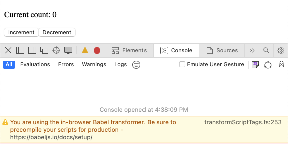
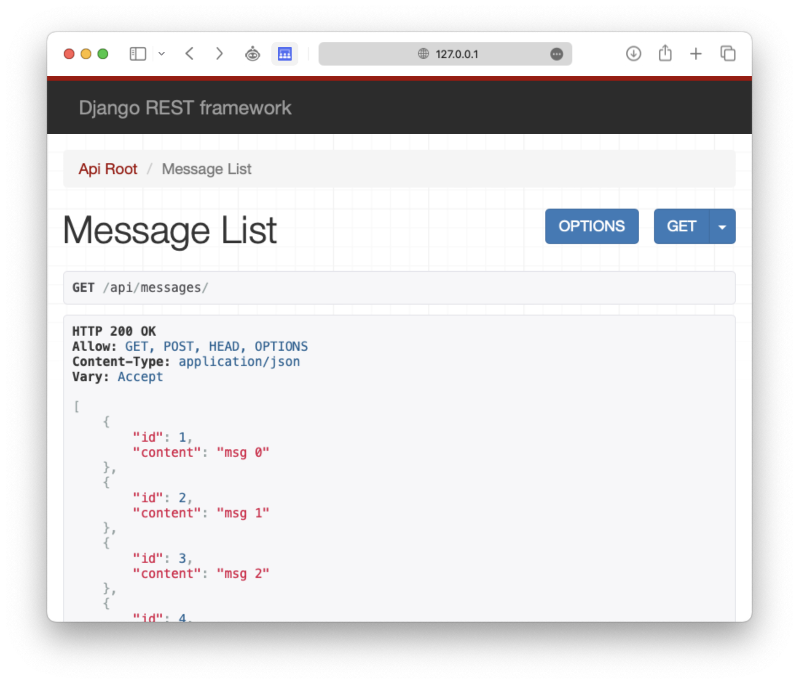
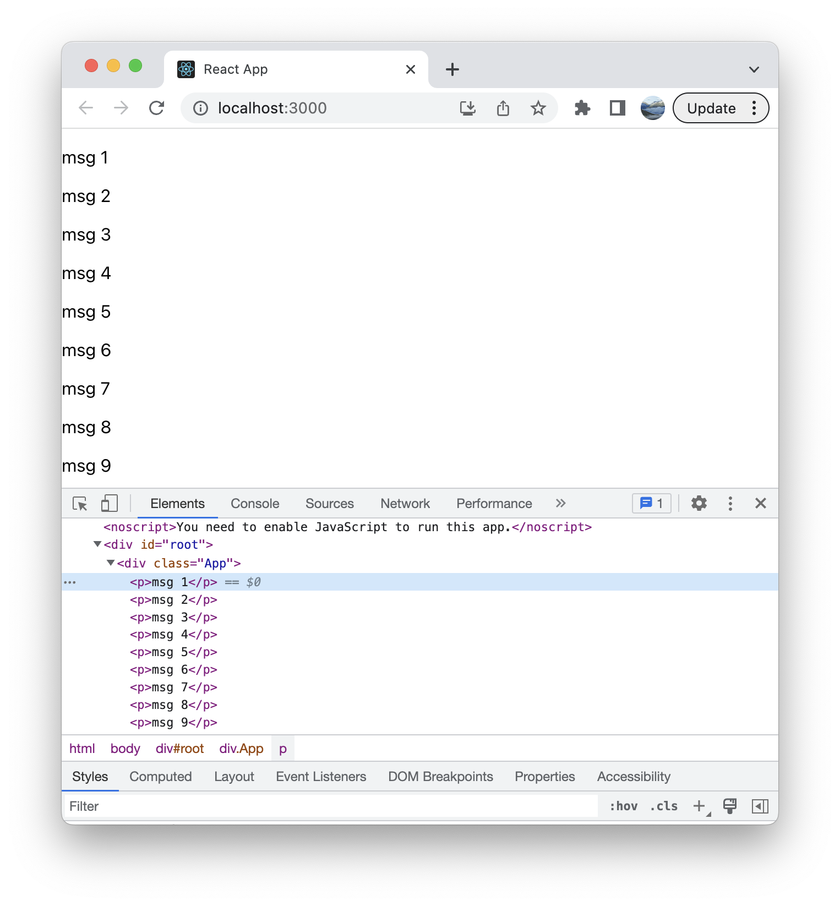

React and Django
================

- [Dynamic User Interfaces: Part 2](#dynamic-user-interfaces-part-2)
- [React](#react)
  - [Components](#components)
  - [Props](#props)
  - [States](#states)
  - [Styling](#styling)
  - [Compiling JSX](#compiling-jsx)
    - [File setup](#file-setup)
    - [Compiling](#compiling)
    - [Viewing the page using Parcel](#viewing-the-page-using-parcel)
- [Incorporating React in Django](#incorporating-react-in-django)
  - [Django setup](#django-setup)
  - [Connecting it to our front-end](#connecting-it-to-our-front-end)
  - [Fixing CORS](#fixing-cors)

Previously we have seen how to create animations and execute an action
based on some event (i.e., load new content if the user scrolled to the
bottom, animate and hide item once the X-button is clicked, etc.).

These actions involved a lot of *imperative programming* statement.
Every line of code described line by line what should happen, what data
should be downloaded, how to manipulate the DOM, etc. In recent years,
however, the concept of *declarative programming* has gained popularity.
On a high level, we declare **what we want** within the declarative
programming paradigm as opposed to stating what to do.

As an example, consider a simple counter (see
[CodePen](https://codepen.io/DauphineWeb/pen/ExdOmYb)).

``` html
<p>Current count: <span id="count">0</span>
<button id="increment">Increment</button>
<button id="decrement">Decrement</button>
```

The buttons `Increment` and `Decrement` should increase and decrease the
counter by 1, respectively. In pure JavaScript, we may do the following.

``` js
let countElement;
let counter = 0;
function changeCounter(amount) {
    counter += amount;
    countElement.innerText = counter;
}
document.addEventListener('DOMContentLoaded', function(event) {
    countElement = document.querySelector('#count');
    document.querySelector('#increment').onclick = () => changeCounter(1);
    document.querySelector('#decrement').onclick = () => changeCounter(-1);
});
```

While the idea is simple and the implementation seems straight-forward.
However, one key issue is that the counter value that the user sees has
to keep up with the current value of `counter` itself.

Imagine that we introduce a new `reset()` function.

``` js
function resetCounter() {
  counter = 0;
  countElement.innerText = counter;
}
```

Here, we *again* need to make sure that, once the counter receives a new
value, that value is also displayed to the user.

To mitigate this, it may make sense to wrap the `counter` into some sort
of object that, (a), saves its current value, (b), stores a list of
elements where that value is displayed, and (c), automatically updates
all outputs once the value is changed.

While we’d be able to derive some implementation that does this, we can
resort to solutions such as [React](https://react.dev/) that already
provide a framework specifically designed for these sets of problems.

# React

The base ideas of React are *components* and *states*. From our counter
example, a component would be the simple `<p>` element showing the
current value, a state the value of our counter.

React also offers a special syntax,
[*JSX*](https://fr.wikipedia.org/wiki/JSX_(JavaScript)), that allows
HTML elements to be embedded in JavaScript code.

``` js
// a js function containing html elements
function App() {
  return (
   <div>
    <h1>Bonjour</h1>
   </div>
  ); 
}
```

Since the browser is not able to understand this special syntax, a
compiler (or transpiler) is needed that translates it into plain
JavaScript. This is where [Babel](https://babeljs.io/) comes in.

## Components

In the simple html document below, we utilize three different scripts:

- [`React`](https://react.dev/): Defines components and their behavior
- [`ReactDOM`](https://www.npmjs.com/package/react-dom): Takes React
  components and inserts them into the DOM
- [`Babel`](https://babeljs.io/): Translates from JSX to plain
  JavaScript that our browsers can interpret.

``` html
<!DOCTYPE html>
<html>
<head>
    <meta charset="UTF-8" />
    <script crossorigin src="https://unpkg.com/react@18/umd/react.development.js"></script>
    <script crossorigin src="https://unpkg.com/react-dom@18/umd/react-dom.development.js"></script>
    <script src="https://unpkg.com/@babel/standalone/babel.min.js"></script>
</head>
<body>
    <div id="root"></div>
    <!-- notice that we have to specify "text/babel" -->
    <script type="text/babel">
        function App() {
            return (
                <h1>Bonjour !</h1>
            );
        };

        let root = ReactDOM.createRoot(document.getElementById('root'));
        root.render(<App />);
    </script>
</body>
</html>
```

Here, the function `App()` (also refered to as the `App` component)
returns a simple `h1` displaying the text `Bonjour !`. With `ReactDOM`,
we can then specify that inside our `root` element in the html it should
render whatever the `App` component returns.

A big advantage of components are their composability. We can define
standalone components and include them in our document wherever we want.

``` html
<div id="root"></div>
<script type="text/babel">
    function DitBonjour(props) {
        return (
            <h1>Bonjour !</h1>
        );
    }
    function App() {
        return (
            <div>
                <DitBonjour />
                <DitBonjour />
                <DitBonjour />
            </div>
        );
    };

    let root = ReactDOM.createRoot(document.getElementById('root'));
    root.render(<App />);
</script>
```

## Props

With the previous example, we displayed `Bonjour !` three times. We may
want to pass additional information to that component, i.e., who to say
`Bonjour` to. This is where properties (or `props`) come in.

In html, we referred to additional tags describing an element as
*attributes*. Here, we can pass props to a component by setting the
attribute of an element.

``` html
<div id="root"></div>
<script type="text/babel">
    function DitBonjour(props) {
        return (
            <h1>Bonjour, {props.name}!</h1>
        );
    }
    function App() {
        return (
            <div>
                <DitBonjour name="Harry" />
                <DitBonjour name="Ron" />
                <DitBonjour name="Hermione" />
            </div>
        );
    };

    let root = ReactDOM.createRoot(document.getElementById('root'));
    root.render(<App />);
</script>
```

Recall that in Django, we used the `{{ ... }}` notation to
programmatically insert a value. In React (or better JSX), this is done
with a single `{ ... }`.

## States

As alluded to at the beggining of the chapter, one of the key benefits
of using React is that of utilizing *states*. A state can be thought of
as some variable that is rendered to the user. Once the value of that
variable changes, React makes sure to display these changes to the user.

With React 18, the general way of creating a state is by calling
[`useState()`](https://react.dev/reference/react/useState). This
function is passed the current value of our variable. For our `counter`,
it could look like this.

``` html
const [counter, setCounter] = React.useState(0);
```

`React.useState()` returns two values:

- the current state (or value),
- a [`set`
  function](https://react.dev/reference/react/useState#setstate) for
  updating the state.

If we update the value through the `set` function, a re-render is
triggered.

It is common convention to give the `set` function the same name as the
variable itself and attach the word `set` before that variable name.

If we now render buttons, we can define an `onClick` attribute that
specifies which function to call when the button is clicked. Note that
there are no braces `()` in `onClick={incCounter}` and
`onClick={decCounter}`.

``` html
<div id="root"></div>
<script type="text/babel">
    function Counter() {
        const [counter, setCounter] = React.useState(0);

        function incCounter() { setCounter(counter+1); }
        function decCounter() { setCounter(counter-1); }
        
        return (
            <div>
                <p>Current count: {counter}</p>
                <button onClick={incCounter}>Increment</button>
                <button onClick={decCounter}>Decrement</button>
            </div>
        );
    }

    let root = ReactDOM.createRoot(document.getElementById('root'));
    root.render(<Counter />);
</script>
```

Notice again that we’re not explicitly setting some `innerText` value to
update the rendered value: `setCounter()` does that for us.

We can introduce a slight modification and, similar to the introductory
example, tell React with what parameters to call a function when a
button is clicked. Note, however, that `onClick={...}` expects a
function that requires no parameters.

``` html
<div id="root"></div>
<script type="text/babel">
    function Counter() {
        const [counter, setCounter] = React.useState(0);
        
        return (
            <div>
                <p>Current count: {counter}</p>
                <button onClick={() => setCounter(counter+1)}>Increment</button>
                <button onClick={() => setCounter(counter-1)}>Decrement</button>
            </div>
        );
    }
    
    function App() {
        return (
            <div>
                <Counter />
            </div>
        )
    }

    let root = ReactDOM.createRoot(document.getElementById('root'));
    root.render(<App />);
</script>
```

## Styling

React offers a custom solution for adding css styles. For the purposes
of this chapter, we will focus on how to get on getting things up and
running without diving too much into the weeds of the language itself.

The [quick introduction](https://react.dev/learn) offers a fantastic
overview over all the features we have discussed so far and much more
(such as styling as well).

## Compiling JSX

The standalone html file from our previous examples work well so far.
However, opening the developer console, we get a warning message telling
us that we should compile the jsx file before-hand.



Generally, this would be done in a separate React application. For our
simple case, we will take a quick look at how this would be done for our
application.

### File setup

In a new directory, we create the following files.

    .
    ├── .babelrc
    ├── index.html
    └── script.jsx

The `script.jsx` file only contains the `script` part of our
application.

``` js
// script.jsx
function Counter() {
    const [counter, setCounter] = React.useState(0);
    
    return (
        <div>
            <p>Current count: {counter}</p>
            <button onClick={() => setCounter(counter+1)}>Increment</button>
            <button onClick={() => setCounter(counter-1)}>Decrement</button>
        </div>
    );
}

function App() {
    return (
        <div>
            <Counter />
        </div>
    )
}

let root = ReactDOM.createRoot(document.getElementById('root'));
root.render(<App />);
```

`.babelrc` is a json file containing plugins needed for our React
application. Here, we include:

- `@babel/preset-env`: compile new JavaScript features to make them
  backwards-compatible for older browsers,
- `@babel/preset-react`: compile JSX and React-specific syntax.

<!-- -->

    {
        "presets": ["@babel/preset-env", "@babel/preset-react"]
    }

Finally, the `index.html` file includes the jsx script after the root
element.

    <!DOCTYPE html>
    <html>
    <head>
        <meta charset="UTF-8" />
        <script crossorigin src="https://unpkg.com/react@18/umd/react.development.js"></script>
        <script crossorigin src="https://unpkg.com/react-dom@18/umd/react-dom.development.js"></script>
    </head>
    <body>
        <div id="root"></div>
        <script src="script.jsx"></script>
    </body>
    </html>

### Compiling

We could compile the `.jsx` to plain `js` using babel. First, we’d need
to install babel within the current directory that we are in.

    npm install --save-dev @babel/core @babel/cli @babel/preset-env @babel/preset-react

Then we can call `npx babel` to compile the `.jsx` file.

    npx babel --out-file compiled_file.js script.jsx

<details>
<summary>
Resulting `compiled_file.js` file
</summary>

``` js
"use strict";

function _slicedToArray(arr, i) { return _arrayWithHoles(arr) || _iterableToArrayLimit(arr, i) || _unsupportedIterableToArray(arr, i) || _nonIterableRest(); }
function _nonIterableRest() { throw new TypeError("Invalid attempt to destructure non-iterable instance.\nIn order to be iterable, non-array objects must have a [Symbol.iterator]() method."); }
function _unsupportedIterableToArray(o, minLen) { if (!o) return; if (typeof o === "string") return _arrayLikeToArray(o, minLen); var n = Object.prototype.toString.call(o).slice(8, -1); if (n === "Object" && o.constructor) n = o.constructor.name; if (n === "Map" || n === "Set") return Array.from(o); if (n === "Arguments" || /^(?:Ui|I)nt(?:8|16|32)(?:Clamped)?Array$/.test(n)) return _arrayLikeToArray(o, minLen); }
function _arrayLikeToArray(arr, len) { if (len == null || len > arr.length) len = arr.length; for (var i = 0, arr2 = new Array(len); i < len; i++) arr2[i] = arr[i]; return arr2; }
function _iterableToArrayLimit(arr, i) { var _i = null == arr ? null : "undefined" != typeof Symbol && arr[Symbol.iterator] || arr["@@iterator"]; if (null != _i) { var _s, _e, _x, _r, _arr = [], _n = !0, _d = !1; try { if (_x = (_i = _i.call(arr)).next, 0 === i) { if (Object(_i) !== _i) return; _n = !1; } else for (; !(_n = (_s = _x.call(_i)).done) && (_arr.push(_s.value), _arr.length !== i); _n = !0); } catch (err) { _d = !0, _e = err; } finally { try { if (!_n && null != _i["return"] && (_r = _i["return"](), Object(_r) !== _r)) return; } finally { if (_d) throw _e; } } return _arr; } }
function _arrayWithHoles(arr) { if (Array.isArray(arr)) return arr; }
function Counter() {
  var _React$useState = React.useState(0),
    _React$useState2 = _slicedToArray(_React$useState, 2),
    counter = _React$useState2[0],
    setCounter = _React$useState2[1];
  return /*#__PURE__*/React.createElement("div", null, /*#__PURE__*/React.createElement("p", null, "Current count: ", counter), /*#__PURE__*/React.createElement("button", {
    onClick: function onClick() {
      return setCounter(counter + 1);
    }
  }, "Increment"), /*#__PURE__*/React.createElement("button", {
    onClick: function onClick() {
      return setCounter(counter - 1);
    }
  }, "Decrement"));
}
function App() {
  return /*#__PURE__*/React.createElement("div", null, /*#__PURE__*/React.createElement(Counter, null));
}
var root = ReactDOM.createRoot(document.getElementById('root'));
root.render( /*#__PURE__*/React.createElement(Counter, null));
```

</details>

The browser does not understand this file, unfortunately, as it utilizes
JS modules that are specific to [NodeJS](https://nodejs.org/en). To let
us view the page, we need a new backend system such as
[Webpack](https://webpack.js.org) or [Parcel](https://parceljs.org) that
lets us view the webpage.

### Viewing the page using Parcel

Within the directory, install parcel.

    npm install -D parcel-bundler

Then, we can use `npx parcel ...` to start a server that shows the web
site specified.

    $ npx parcel index.html
    Server running at http://localhost:1234
    ✨  Built in 281ms.

Many libraries move towards a more seemless experience when it comes to
developing in `.jsx`. You can take a look at, i.e.,
[Vite](https://vitejs.dev) or [Snowpack](https://www.snowpack.dev) that
both offer a quick setup, automatic refreshes when a file changes,
plugins for common libraries such as Babel, Sass, etc., and much more.

# Incorporating React in Django

We have seen that, while not recommended, it is technically possible to
write a plain html file that works with react components.

For a more ideal approach, we will completely separate the frontend from
the backend. That means that Django will not be concerned with rendering
any of our UI, it will only offer an interface for the data and the
database that we are working with.

## Django setup

For the Django project, we will only require an end-point that returns
JSON objects. To make matters more interesting, we will have a look at
how we can use the [Django REST
framework](https://www.django-rest-framework.org) to better streamline
this process.

1.  Create the project

<!-- -->

    django-admin startproject project
    cd project
    python manage.py startapp app

2.  Add the new app `app` to the list of installed apps in
    `projects/settings.py`.

``` python
# project/urls.py
INSTALLED_APPS = [
    'app',
    'django.contrib.admin',
    'django.contrib.auth',
    # ...
]
```

Previously, we have always manually created a python dictionary object
and used a
[`JsonResponse`](https://docs.djangoproject.com/en/4.2/ref/request-response/#jsonresponse-objects)
to serialize the object. This time, we will make use of the [Django REST
framework](https://www.django-rest-framework.org) that lets us better
design our API.

3.  Install the library using `pip`

<!-- -->

    pip install djangorestframework

4.  Add `rest_framework` to the list of installed apps in
    `project/settings.py`

``` python
# project/settings.py
INSTALLED_APPS = [
    'rest_framework',
    # ...
]
```

5.  We create a simple model in `app/models.py` that represents some
    text.

``` python
# app/models.py
from django.db import models

class Message(models.Model):
    content = models.TextField()
    
    def __str__(self):
        return self.content
```

6.  Run migrations.

<!-- -->

    python manage.py makemigrations
    python manage.py migrate

7.  We can add some values using the django shell.

``` shell
$ python3 manage.py shell         
Python 3.11.3 (main, Apr  7 2023, 20:13:31) [Clang 14.0.0 (clang-1400.0.29.202)]
Type 'copyright', 'credits' or 'license' for more information
IPython 8.13.2 -- An enhanced Interactive Python. Type '?' for help.

In [1]: from app.models import Message

In [2]: for i in range(10):
   ...:     Message(content="msg "+str(i)).save()
   ...: 

In [3]: Message.objects.all()
Out[3]: <QuerySet [<Message: msg 0>, <Message: msg 1>, <Message: msg 2>, ..., <Message: msg 9>]>
```

8.  Using the rest framework, we create a separate serializer. To do
    this, add a `app/serializers.py` file.

``` python
# app/serializers.py
from rest_framework import serializers
from .models import Message

class MessageSerializer(serializers.ModelSerializer):
    class Meta:
        model = Message
        fields = ['id', 'content']
```

9. In `app/views.py`, we then declare a new class that specifies how
    that tour `MessageSerializer` should be used to turn `Message`
    objects into JSON objects. Note that we are using a [class-based
    view](https://docs.djangoproject.com/en/4.2/topics/class-based-views/)
    as opposed to simple functions. While they may be not as flexible as
    functions, they are certainly easier and more robust and perfectly
    applicable for our use case.

``` python
# app/views.py
from rest_framework import viewsets
from .models import Message
from .serializers import MessageSerializer

class MessageViewSet(viewsets.ModelViewSet):
    queryset = Message.objects.all()
    serializer_class = MessageSerializer
```

10. Finally, `project/urls.py` should offer a url pointing to our
    class-based view.

``` python
# app/urls.py
from django.contrib import admin
from django.urls import path, include
from rest_framework import routers
from app import views

router = routers.DefaultRouter()
router.register(r'messages', views.MessageViewSet)

urlpatterns = [
    path('admin/', admin.site.urls),
    path('api/', include(router.urls)),
]
```

Notice that we are now using the REST framework’s routing system. We
tell Django to redirect requests to `'api/` to `router.urls`. In turn,
the `router` object then offers an endpoint `api/messages/` that returns
whatever the `MessageViewSet` class offers.

Navigating to `api/messages/` should now give us a site rendered by the
Django REST framework.



## Connecting it to our front-end

Instead of working with template files, we start with a completely new
project that is only concerned with the front-end. The following must be
installed on your machine to get it to work.

- [NodeJS](https://nodejs.org/en)
- [React](???)

Outside of the Django project, create a new react project. Open the
newly created folder in your favorite code editor.

    npx create-react-app myapp
    cd myapp

`npx` creates the entire front-end project for us. The project strucure
may look something like this.

    .
    ├── README.md
    ├── package-lock.json
    ├── package.json
    ├── public
    │   ├── ...
    │   └── robots.txt
    └── src
        ├── App.css
        ├── App.js
        ├── App.test.js
        ├── index.css
        ├── index.js
        ├── logo.svg
        ├── reportWebVitals.js
        └── setupTests.js

`src/App.js` is where we will put all our acquired JSX knowledge to use.

``` js
// src/App.js
import React, { useEffect, useState } from 'react';

function App() {
    const [messages, setMessages] = useState([]);
    
    // assuming the Django server runs on localhost:8000
    const fetchObjects = () => {
        fetch('http://localhost:8000/api/messages/')
            .then(response => response.json())
            .then(data => setMessages(data));
    }

    // alternatively, use `useEffect` to load the data once the component is rendered
    // useEffect(() => {
    //     fetch('http://localhost:8000/api/messages/')
    //         .then(response => response.json())
    //         .then(data => setMessages(data));
    // }, []);

    return (
        <div className="App">
            {messages.map(message => (
                <p key={message.id}>{message.content}</p>
            ))}
            <button onClick={fetchObjects}>Load messages</button>
        </div>
    );
}

export default App;
```

To display an array of messages, we use the `.map()` method here.

Now, running `npm start` should automatically open a new browser window
with our frontend. Make sure that the Django project is also running at
the same time (and that its port is set to 8000).

However, we now get a CORS, or a Cross-Origin Resource Sharing issue.
This stems from the fact that Django, by default, only allows requests
from the same origin, i.e., the browser directly visiting a Django
website and requesting data from there. To fix this, we need to tell
Django to also allow requests from port 3000 (the default port for the
React application).

## Fixing CORS

The easiest way to tell Django about port 3000 is to use the
cors-headers package. Install it using pip.

    pip install django-cors-headers

Then, we only have to make a few changes to `project/settings.py`.

First, add `'corsheaders'` to the list of installed apps.

``` python
INSTALLED_APPS = [
    ...
    'corsheaders',
    ...
]
```

Then, add the `CorsMiddleware` to the list of installed middlewares. A
middleware performs certain checks on incoming requests.

``` python
MIDDLEWARE = [
    ...
    'corsheaders.middleware.CorsMiddleware',
    'django.middleware.common.CommonMiddleware',
    ...
]
```

Finally, add a new variable called `CORS_ALLOWED_ORIGINS` that lists the
urls from which cross-origin requests are allowed.

``` python
CORS_ALLOWED_ORIGINS = [
    "http://localhost:3000",
]
```

<details>
<summary>
The entire settings.py file
</summary>

``` python
"""
Django settings for project project.

Generated by 'django-admin startproject' using Django 4.1.7.

For more information on this file, see
https://docs.djangoproject.com/en/4.1/topics/settings/

For the full list of settings and their values, see
https://docs.djangoproject.com/en/4.1/ref/settings/
"""

from pathlib import Path

# Build paths inside the project like this: BASE_DIR / 'subdir'.
BASE_DIR = Path(__file__).resolve().parent.parent


# Quick-start development settings - unsuitable for production
# See https://docs.djangoproject.com/en/4.1/howto/deployment/checklist/

# SECURITY WARNING: keep the secret key used in production secret!
SECRET_KEY = 'django-insecure-c4n1x%(#%0ax@!_#!%%me^&gsy)$ewaa1c34!v+l()q^#o^r1$'

# SECURITY WARNING: don't run with debug turned on in production!
DEBUG = True

ALLOWED_HOSTS = []


# Application definition

INSTALLED_APPS = [
    'app',
    'rest_framework',
    'corsheaders',
    'django.contrib.admin',
    'django.contrib.auth',
    'django.contrib.contenttypes',
    'django.contrib.sessions',
    'django.contrib.messages',
    'django.contrib.staticfiles',
]

MIDDLEWARE = [
    'django.middleware.security.SecurityMiddleware',
    'django.contrib.sessions.middleware.SessionMiddleware',
    'corsheaders.middleware.CorsMiddleware',
    'django.middleware.common.CommonMiddleware',
    'django.middleware.csrf.CsrfViewMiddleware',
    'django.contrib.auth.middleware.AuthenticationMiddleware',
    'django.contrib.messages.middleware.MessageMiddleware',
    'django.middleware.clickjacking.XFrameOptionsMiddleware',
]

CORS_ALLOWED_ORIGINS = [
    "http://localhost:3000",
]

ROOT_URLCONF = 'project.urls'

TEMPLATES = [
    {
        'BACKEND': 'django.template.backends.django.DjangoTemplates',
        'DIRS': [],
        'APP_DIRS': True,
        'OPTIONS': {
            'context_processors': [
                'django.template.context_processors.debug',
                'django.template.context_processors.request',
                'django.contrib.auth.context_processors.auth',
                'django.contrib.messages.context_processors.messages',
            ],
        },
    },
]

WSGI_APPLICATION = 'project.wsgi.application'


# Database
# https://docs.djangoproject.com/en/4.1/ref/settings/#databases

DATABASES = {
    'default': {
        'ENGINE': 'django.db.backends.sqlite3',
        'NAME': BASE_DIR / 'db.sqlite3',
    }
}


# Password validation
# https://docs.djangoproject.com/en/4.1/ref/settings/#auth-password-validators

AUTH_PASSWORD_VALIDATORS = [
    {
        'NAME': 'django.contrib.auth.password_validation.UserAttributeSimilarityValidator',
    },
    {
        'NAME': 'django.contrib.auth.password_validation.MinimumLengthValidator',
    },
    {
        'NAME': 'django.contrib.auth.password_validation.CommonPasswordValidator',
    },
    {
        'NAME': 'django.contrib.auth.password_validation.NumericPasswordValidator',
    },
]


# Internationalization
# https://docs.djangoproject.com/en/4.1/topics/i18n/

LANGUAGE_CODE = 'en-us'

TIME_ZONE = 'UTC'

USE_I18N = True

USE_TZ = True


# Static files (CSS, JavaScript, Images)
# https://docs.djangoproject.com/en/4.1/howto/static-files/

STATIC_URL = 'static/'

# Default primary key field type
# https://docs.djangoproject.com/en/4.1/ref/settings/#default-auto-field

DEFAULT_AUTO_FIELD = 'django.db.models.BigAutoField'
```

</details>

With both servers up and running, going to <http://localhost:3000/>
should now hopefully display the 10 objects from our database.


